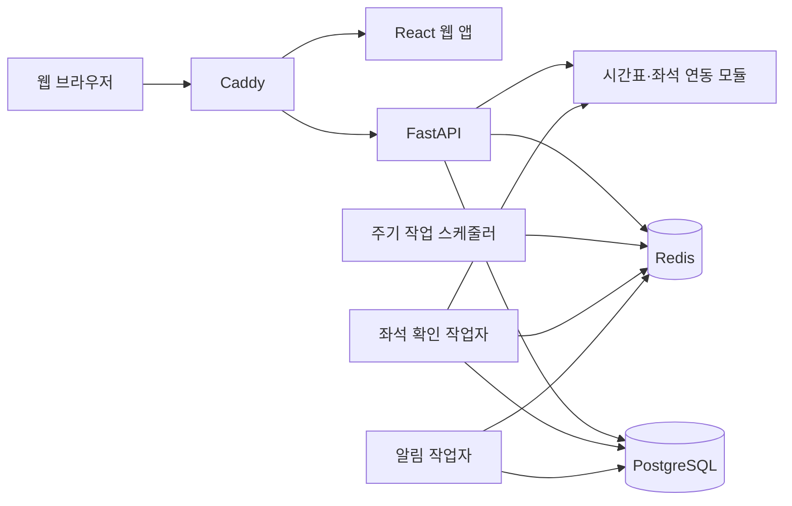

# 시스템 구조

이 문서는 레일웨잇의 전체 구성과 각 구성 요소의 책임을 설명합니다.

## 설계 목표

레일웨잇은 한 명의 관리자가 직접 운영하는 개인용 서비스입니다. 설계에서 우선하는 기준은 다음과 같습니다.

- 확인하지 못한 좌석 상태를 추정하지 않습니다.
- 같은 작업이 중복 실행되어도 예약 요청이 반복되지 않도록 막습니다.
- 시간표, 좌석 관측, 예약 결과를 서로 다른 정보로 다룹니다.
- 결제정보를 저장하거나 결제를 자동화하지 않습니다.
- 외부 서비스가 느리거나 차단되어도 마지막으로 확인된 데이터와 실패 원인을 구분합니다.

## 전체 구성



Docker Compose는 위 서비스를 하나의 배포 단위로 실행합니다. 웹과 API만 외부 요청을 받고, 데이터베이스와 작업 큐는 내부 네트워크에 둡니다.

## 구성 요소

### 웹 앱

`apps/web`은 React와 TypeScript로 작성된 반응형 PWA입니다.

- 여정과 시간 범위 입력
- 가상 키보드의 실제 가용 높이를 반영하는 모바일·터치 태블릿 전용 역 선택
- 중첩 modal에 적용하는 참조 카운트 기반 문서 스크롤 잠금과 원래 위치 복원. 접속 중 알림센터는 페이지 사용을 막지 않는 비차단 surface로 유지하고, 달력은 알림센터보다 위, 공식 인계·좌석 입력·역 선택 dialog보다 아래에 표시합니다.
- 열차와 좌석 등급 선택
- 감시 중인 대기와 결제 필요 항목 표시
- 알림·철도 계정·화면 설정
- 공식 앱 또는 홈페이지로 이동하기 전 안내

화면은 API 응답을 그대로 표시하지 않습니다. 외부 응답을 검증한 뒤 화면에 필요한 형태로 바꾸며, 출처가 불명확한 좌석은 `확인 필요`로 표시합니다.

화면 갱신·좌석 관측 간격 API는 `observation_interval_seconds`를 전역 관측 주기의 단일 DTO 필드로 사용합니다. 웹 API 경계는 이 필드를 검증해 화면 모델로 명시적으로 변환하고, 저장 요청에도 같은 필드명을 사용합니다.

공식 채널 인계는 provider payload의 임의 URI를 실행하지 않고 코드에 고정한 HTTPS 주소로 정규화합니다. 예매 단계는 운영사 예매 페이지, `payment_required`·완료 확인 단계는 예약·승차권 조회 페이지를 선택하며 HTTPS는 항상 새 브라우저 창으로 엽니다. 순수 PWA에는 Android `PackageManager` 권한이 없어 package 실행이나 설치 조회를 하지 않습니다. 코레일+는 예매에 `korailtalk://navigation?view=booking`, 예약 확인에 `korailtalk://navigation?view=bookedTicket`을 사용합니다. 후자는 하단 `나의 티켓`이 아니라 `전체메뉴 → 예약 승차권 조회 · 취소`와 같은 화면으로 이동합니다. SRT는 BROWSABLE `srapp://main`을 예매 홈에 사용하고, 같은 진입점에 앱이 명시적으로 읽는 고정 문자열 extra `btnNo=2`를 전달해 승차권 확인으로 이동합니다. 검증된 intent도 사용자 클릭 안에서 `target="_blank"` anchor로 실행해 설치 앱은 그대로 열고 미설치 HTTPS fallback은 외부 Custom Tab에 격리합니다. 코레일 booking·ticket과 SRT main·ticket은 서로 독립된 검증 버전·기능 플래그를 가지며, 사용자·여정·인증 데이터는 intent에 넣지 않습니다. 기본 빌드는 모든 앱 경로를 끕니다. 세부 QA 계약은 [Android 공식 앱 인계 검증](ANDROID_APP_HANDOFF_QA.md)에 있습니다.

### API

`apps/api`의 FastAPI 서비스는 다음 책임을 가집니다.

- 관리자 인증과 세션
- 입력값 검증
- 대기 작업 생성·수정·취소
- 시간표와 좌석 정보 조회
- 알림 채널 설정
- 작업 상태와 이벤트 제공

경로 함수는 인증, 요청·응답 검증, 트랜잭션 경계를 담당합니다. 좌석 판단, 예약 시도, 알림 전달 같은 정책은 별도 서비스 모듈에 둡니다.

서비스 health transport 계약은 `health/schemas.py`의 `HealthResponse`가 canonical owner입니다.
`main.py`의 `/health`는 owner를 직접 사용하고, 중앙 `schemas.py`는 기존 import·pickle 호환을 위해 같은
Pydantic class 객체를 exact alias로만 노출합니다. `/healthz`·`/readyz`의 응답 형식과 readiness 판단은 이번
구조 이동에서 바꾸지 않았습니다. 이 이동으로 중앙 `schemas.py`에는 실제 Pydantic class 선언이 남지 않으며,
각 기능의 transport owner를 모아 보여 주는 classless compatibility facade 역할만 합니다.
production `src`와 PostgreSQL 운영 검증 script도 이 facade를 내부 의존으로 사용하지 않습니다. provider 계정·
runtime·예약 실행은 `provider_account_management/schemas.py`, 관찰·capability·예약 계약은 각각
`observations/contracts.py`·`provider_registry/contracts.py`·`reservations/contracts.py`를 직접 사용합니다.
중앙 facade의 direct·wildcard·module/package attribute·alias·동적 import 재유입은 source와 script 양쪽에서
경계 테스트로 차단하며, 기존 외부 import·pickle 호환을 위한 exact alias 표면은 유지합니다.
중앙 `schemas.py`는 local definition 없이 canonical schema·contract 76개를 exact alias하고, 중앙
`models.py`는 ORM mapper 23개와 `utcnow`를 exact alias하는 eager metadata registry입니다. schema hub의
production·script consumer는 0이며 model hub는 전체 metadata bootstrap을 위한 `main.py`와 Alembic
`migrations/env.py`만 소비합니다. 새 feature code는 두 hub를 거치지 않고 기능 owner를 직접 사용합니다.

### 작업 처리

Celery 작업은 역할별 큐로 나뉩니다.

- 좌석 확인과 상태 전이
- 알림 전송과 재시도
- 주기 작업 예약
- 선택적인 철도사 연동 작업

좌석 확인과 알림 전송을 분리해 느린 외부 알림이 좌석 확인을 막지 않도록 합니다. 같은 운영사에 대한 동시 실행은 제한합니다.

동기 Celery task shell이 만든 작업별 event loop 안에서 비동기 작업과 DB engine 정리를 끝내는 순서는
`worker_task_runtime.py`가 소유합니다. owner는 DB·Celery를 직접 import하지 않고 작업 awaitable과
`dispose_engine` callback만 받아 작업 성공·실패·취소 뒤에도 `finally`로 정리를 한 번 실행합니다. `worker.py`의
기존 `_run_isolated` wrapper는 호출 시점의 `engine.dispose`를 주입하고, `asyncio.run`·공개 Celery task 이름·
성공/실패 metric은 계속 composition shell에 남습니다. 작업과 정리가 모두 실패할 때 정리 예외가 최종 예외가
되는 기존 Python `finally` 우선순위도 구조 이동에서 바꾸지 않았습니다.
`worker.py`는 local top-level 함수 27개와 dependency 조립 closure 3개, Celery task 4개만 남은 frozen
composition root입니다. 직접 SQL·transaction·FastAPI route·provider adapter method·credential/secret 처리는
소유하지 않으며 canonical application/runtime과 task별 engine cleanup을 조립합니다. 새 정책·UoW를 이 root에
추가하지 않고 기능 owner와 typed dependency bundle로 둡니다.

### 데이터 저장소

PostgreSQL에는 관리자, 대기 작업, 열차 후보, 좌석 관측, 예약 시도, 알림 전송 이력을 저장합니다.

Redis는 작업 큐, 짧은 캐시, 중복 실행 방지 잠금과 호출 제한 상태에 사용합니다. 비밀번호, 쿠키, 브라우저 저장 상태를 Redis에 보관하지 않습니다.

### 철도사 연동

철도사별 연동 코드는 공통 계약을 구현합니다.

- 시간표를 조회할 수 있는가
- 좌석 상태를 확인할 수 있는가
- 대기 등록에 쓸 수 있는 근거가 있는가
- 제한적인 예매 시도를 지원하는가

기능이 구현되어 있고 운영자가 필요한 설정을 모두 켠 경우에만 사용할 수 있습니다. 설정이나 근거가 부족하면 해당 기능을 사용할 수 없도록 막습니다.

provider 기능 표면의 transport 계약은 `provider_registry/contracts.py`의 `ProviderCapabilities`가 canonical
owner입니다. 공통 provider protocol·adapter와 registry application·HTTP는 이 leaf contract를 직접 사용하고,
중앙 `schemas.py`와 top-level `providers.py`는 기존 import·pickle 호환을 위한 같은 class 객체의 exact alias만
노출합니다. owner는 `Provider` enum과 공통 Pydantic base 외에 adapter·설정·registry application을 역참조하지
않습니다. capability의 기본값과 공개 OpenAPI component는 이동 전과 같으며, 실제 기능·설정·승인 근거의
교집합보다 넓은 값을 만들지 않는 정책도 그대로입니다.

KORAIL Chromium과 SRT 연동 모듈은 선택 프로필에서만 실행됩니다. 기본 설치에서는 좌석 감시와 예매 시도가 꺼져 있습니다.

## 주요 흐름

### 열차 검색

1. 사용자가 출발역, 도착역, 날짜와 시간 범위를 입력합니다.
2. API가 역 식별자와 입력값을 확인합니다.
3. 운영사별 시간표를 조회합니다.
4. 한 운영사가 실패해도 다른 운영사의 정상 결과는 유지합니다.
5. 좌석 상태를 뒷받침할 근거가 없으면 시간표만 표시하고 좌석 관련 작업은 제공하지 않습니다.

### 대기 등록

1. 사용자가 열차와 좌석 등급을 선택합니다.
2. API가 최근 좌석 관측과 등록 가능 여부를 다시 확인합니다.
3. 열차와 좌석 등급마다 독립된 대기 작업을 만듭니다.
4. 화면에 대기 등록 결과를 표시합니다.

API에서는 `watch_management/create_application.py`가 등록 근거의 exact identity·만료 검증, 작업과 후보
aggregate 생성, idempotency·`watch.created` outbox와 commit을 하나의 생성 transaction으로 소유합니다.
`watch_management/command_runtime.py`는 생성·수정 application에 필요한 idempotency·outbox·provider URL·
설정 gate·채널 및 집중 관찰 검증·dedupe·clock을 호출 시점에 조립합니다. runtime은 FastAPI나
`commit`·`rollback`·`refresh`를 알지 않고, watch HTTP가 application 오류만 기존 403·404·409·422 응답으로
변환합니다. 중앙 `services.py`의 create/update wrapper는 기존 import와 호출 시점 monkeypatch 호환만
유지하며 production HTTP는 canonical runtime을 직접 사용합니다.

중앙 `services.py`는 local wrapper 14개만 남은 frozen compatibility composition facade입니다. production
source는 이 허브를 import하지 않고 각 feature application/runtime을 직접 사용하며, PostgreSQL fencing 검증용
운영 script 두 곳만 기존 이름을 사용합니다. facade는 호출 시점 dependency bundle 조립과 application 오류의
기존 403·404·409·422 `HTTPException` 변환만 유지하고 직접 SQL·row lock·commit·rollback·flush·refresh,
provider transport를 소유하지 않습니다. 새 정책·UoW를 이 파일에 다시 추가하지 않습니다.

만료된 등록 근거의 409 detail 계약은 `watch_management/schemas.py`의
`RegistrationEvidenceConflictDetail`이 canonical owner입니다. 중앙 `schemas.py`는 기존 import 호환을 위해
같은 Pydantic class 객체만 alias로 노출하고, `services.create_watch`는 feature owner를 직접 사용해
`code`·`reason`·`message` dict를 기존처럼 한 번만 FastAPI detail로 감쌉니다. 이 model은 현재 OpenAPI response
component로 공개되지 않으며, 구조 이동과 409 문서화 개선은 별도 변경으로 유지합니다.

대기 작업의 부분 수정 요청 계약은 같은 `watch_management/schemas.py`의 `WatchUpdate`가 canonical
owner입니다. watch HTTP, update application과 중앙 `services.update_watch` 호환 wrapper는 이 owner를 직접
사용하고, 중앙 `schemas.py`는 기존 import 호환을 위해 같은 Pydantic class 객체만 alias로 제공합니다. 생략한
필드와 전달한 필드는 `model_fields_set`·`exclude_unset=True`로 구분하며 빈 `{}` 요청도 schema 단계에서는
유효합니다. 반면 JSON dict에 명시한 `null`은 알려지지 않은 필드를 포함해 모두 거절하고, 결제 기한은 timezone이
있는 값만 받아 UTC로 정규화합니다. OpenAPI의 nullable 표현과 실제 명시적 `null` 거절 사이의 기존 차이,
활성 작업의 수정 가능 필드·후보 일치·집중 관찰 용량 정책은 이번 구조 이동에서 바꾸지 않았습니다.

대기 작업 생성 요청과 중첩 후보 계약도 `watch_management/schemas.py`의 `WatchCreate`·
`WatchCandidateCreate`가 함께 소유합니다. watch HTTP, create application과 중앙 `services.create_watch` 호환
wrapper는 `WatchCreate` owner를 직접 사용하고, 중앙 `schemas.py`는 두 canonical class 객체의 exact alias만
제공합니다. 후보의 timezone 필수·열차 번호 trim·도착 순서와 watch의 KST 서비스 날짜·역 node ID·시간 범위·
후보 identity·연속 우선순위·좌석 등급·열차 집합 검증을 그대로 유지합니다. 공식 provider의 등록 근거 확인,
experimental gate, 채널 존재 여부와 transaction은 schema가 아니라 create application 책임입니다. 따라서
빈 후보 목록, MOCK의 같은 node ID, 순서가 뒤바뀐 연속 우선순위와 일부 느슨한 list item 입력도 물리 이동
단계에서는 기존 계약대로 유지합니다.

대기 작업 조회 응답 aggregate도 `watch_management/schemas.py`가 소유합니다.
`WatchRead`·`WatchCandidateRead`와 후보의 최신 관찰·예약 시도 read schema를 함께 두어 중첩 annotation과
forward reference identity를 한 owner에서 유지합니다. 후보의 등록 근거는
`timetable_management/schemas.py`의 `TimetableSeatEvidenceRead`, 최신 관찰 오류 분류는
`observations/contracts.py`의 `ObservationErrorCategory`를 직접 참조합니다. watch HTTP와 read model은
canonical `WatchRead`를 사용하고 중앙 `schemas.py`는 기존 import·pickle 호환을 위한 네 객체의 exact alias만
노출합니다. 조회 시간대 정규화·운행 provenance 완전성·예약 시도 시간 순서·공식 HTTPS URL과 기존 OpenAPI
component는 바꾸지 않습니다.

### 좌석 변화 확인

1. 스케줄러가 확인할 작업을 큐에 넣습니다.
2. 작업자가 같은 운영사의 중복 실행과 호출 제한을 확인합니다.
3. 새로운 관측값을 저장합니다.
4. 이전 상태와 비교해 의미 있는 변화만 작업 상태와 알림으로 만듭니다.
5. 확인이 불완전하면 좌석을 찾은 것으로 처리하지 않습니다.

API에서는 `observations/recording_application.py`가 한 관측의 운영 투영, 관측 저장, 후보 상태,
outbox와 선택적 작업 상태 전이를 같은 호출자 소유 트랜잭션 안에서 처리합니다. 관측 그룹 application은
잠금, 여러 후보의 요약과 최종 commit을 소유하므로 개별 관측 owner가 별도 commit·rollback을 하지 않습니다.

좌석 발견과 실행 가능 여부의 공통 분류는 순수 `observations/status_policy.py`가 소유합니다. 일반 좌석
발견은 `AVAILABLE`·`LIMITED`·`STANDING_PLUS_SEAT`, 실행 가능 상태는 이 세 값과
`WAITLIST_AVAILABLE`로 고정합니다. 단일 관측 기록, 관찰 그룹 요약과 예약 시도 claim 조립은 같은
frozenset 객체를 사용하며 provider·DB·runtime에 의존하지 않습니다.

provider 실패 코드를 legacy watch 상태·수동 재개·공식 인계 결정으로 투영하는 정책은
`watch_management/provider_failure_policy.py`가 소유합니다. `ErrorPolicyResult`, 429·보호 응답 cooldown,
보호 신호 집합과 분류·종료 시각 계산을 한 leaf에 두고 provider circuit·HTTP·DB를 참조하지 않습니다.
현재 production operational consumer는 없으며 top-level `policy.py`와 중앙 `schemas.py`는 기존 import·pickle
호환을 위해 canonical class·함수·상수의 exact alias만 노출합니다. dedupe key와 전역 관찰 cadence는 서로
다른 변경 이유이므로 top-level `policy.py`에 그대로 남습니다.

provider 좌석 관찰의 입출력 계약은 `observations/contracts.py`의 `ObservationErrorCategory`·
`SeatObservationRequest`·`SeatObservationResult`가 canonical owner입니다. 관찰 application, 공통 provider
contract, KORAIL/SRT source·adapter와 `services.py`·`worker.py`를 포함한 production consumer 17개는 이 owner를
직접 사용합니다. 중앙 `schemas.py`는 기존 import·pickle·`ReservationRequest` 상속과 read model annotation
호환을 위해 같은 세 객체의 exact alias만 노출합니다. request의 식별자·역·aware 출발 시각·구체 좌석 등급·
승객 수, result의 source·aware freshness·오류 category·지연 시간 검증과 `extra="forbid"`는 이동 전과 같고,
canonical 계약만 import한 process에는 중앙 schema hub가 로딩되지 않습니다.

provider 단발 예약의 입력·진행 근거·정규화 결과 계약은 `reservations/contracts.py`의
`ReservationRequest`·`ReservationProgressStageName`·`ReservationProgressStage`·`ReservationResult`가
canonical owner입니다. 예약 application, 공통 provider 계약, KORAIL/SRT adapter·executor와 watch HTTP를
포함한 production consumer 15개는 이 owner를 직접 사용합니다. `ReservationRequest`는 canonical 관찰 request를
직접 상속하며, 결과의 공식 handoff URL은 provider-neutral 공식 URL 정책을 직접 참조합니다. 중앙
`schemas.py`는 기존 import·pickle 호환을 위해 네 객체의 exact alias만 유지합니다. 중앙 compatibility alias의
URL 정책 속성을 재할당해도 canonical validator에는 전달되지 않으며 allowlist 검증을 약화하지 않는
fail-closed import-only 경계입니다. request·stage·result의 Pydantic 검증, 중첩 stage identity와 OpenAPI wire는
이동 전과 같습니다.

실행 adapter가 좌석 감시 capability를 제공하기 시작할 때 기존 공식 watch의 다음 확인 시각을 재무장하는
UoW는 `watch_management/arming_application.py`가 소유합니다. KORAIL·SRT만 대상으로 동일 provider·official
mode·허용 상태·`next_check_at IS NULL` 행을 `FOR UPDATE SKIP LOCKED`로 잠그고, 행이 있을 때만 전달받은
시각으로 갱신해 commit합니다. worker는 task-scoped adapter 생성 뒤 이 application에 현재 session factory와
provider resolver를 주입하며, expiry·stale recovery·due 조회보다 먼저 실행하고 adapter lifecycle은 기존
due pipeline이 계속 소유합니다.

due sweep 전에 arming을 시작할 provider 순서는 순수 `observations/due_provider_policy.py`가 소유합니다.
SRT를 항상 첫 대상으로 둔 새 list를 반환하고, KORAIL background 3중 opt-in 결과가 참일 때만 KORAIL을 두
번째에 추가합니다. 이 목록은 due watch 전체의 처리 allowlist가 아니며 capability 판정, DB 조회, adapter
생명주기를 소유하지 않습니다. 한 번의 sweep에서 enablement gate를 평가하고 provider arm 대상을 선택한 뒤
due pipeline dependency를 만들고 실행하며, 성공한 group 수만 metric에 기록하는 순서는
`observations/due_runtime.py`가 소유합니다. 실패 예외는 변환하지 않고 metric도 기록하지 않습니다. worker는
매 호출 시점의 settings·selector·pipeline·metric을 dependency bundle로 조립하는 호환 wrapper만 유지하므로
기존 monkeypatch seam과 Celery task 이름·queue·beat 계약은 바뀌지 않습니다.

한 watch group의 provider 판정과 execution lease·adapter 생명주기는
`observations/group_runtime.py`가 소유합니다. provider가 전달되지 않은 단건 실행만 canonical group query로
provider를 확인하고, KORAIL·SRT는 adapter 생성 전에 anonymous/public execution lease를 획득합니다. lease를
얻지 못하면 provider I/O와 adapter 정리를 시작하지 않습니다. 상위 due pipeline이 공유 adapter를 전달한
경우 group runtime은 관찰 뒤 drain과 lease release만 수행하고, 직접 만든 adapter만 drain 뒤 close한 다음
lease를 release합니다. 관찰·drain·close 실패에도 뒤쪽 정리가 실행되는 중첩 `finally` 순서를 유지합니다.
adapter의 drain·close 일반 예외를 흡수하고 provider 식별자만 categorical warning으로 남기는 정책은
`provider_execution/lifecycle_runtime.py`가 소유합니다. upstream 예외 원문이나 credential은 로그에 전달하지
않으며 `CancelledError`는 계속 전파합니다. worker는 호출 시점의 logger와 adapter/provider를 주입하는 얇은
wrapper만 유지하므로 group·due pipeline의 기존 cleanup/lease release 순서는 바뀌지 않습니다.
KORAIL task-local 관측 source의 조립과 소유권은 `provider_adapters/korail_execution.py`가 canonical
owner입니다. 실험 기능·browser adapter·seat monitoring의 세 설정이 모두 켜진 경우에만 source와 Redis
cooldown client를 만들고, 호출마다 현재 Celery task event loop가 소유하는 새 인스턴스를 반환합니다. 소유한
source를 닫은 뒤 Redis client를 닫으며 source 종료가 실패해도 Redis 종료는 `finally`로 보장합니다. 외부에서
주입한 source는 adapter가 닫지 않습니다. top-level `korail_execution.py`는 기존 5개 공개 심볼의 exact alias
facade이고 worker도 canonical enablement policy를 직접 사용합니다.
SRT task-local source의 local·sidecar·고정 fullstack fixture 선택은
`provider_adapters/srt_source_runtime.py`가 canonical owner입니다. 실험 기능·request-time seat status·
background monitoring의 세 설정이 모두 켜져야 source를 만들며 sidecar 설정이 켜지면 정확한 내부
URL·timeout·token으로 client를 만들고 local Redis/source는 만들지 않습니다. local 경로는 호출마다 새 Redis
cooldown client와 source를 만들고, test 환경의 고정 fixture URL이 명시된 경우에만 fixture client factory와
별도 source 이름을 주입합니다. 소유 source drain이 실패해도 Redis 종료는 `finally`로 보장합니다. top-level
`srt_execution.py`는 기존 5개 공개 심볼의 exact alias facade이고 canonical execution adapter는 sibling source
runtime을 직접 사용합니다.
고정 test origin의 JSON 응답을 SRTrain 모양으로 투영하는 fixture transport는
`provider_adapters/srt_fullstack_fixture.py`가 소유합니다. `main.py`와 SRT source runtime만 canonical owner를
소비하고 top-level `fullstack_srt_fixture.py`는 기존 public 9개·private 0개와 구형 pickle 3개를 유지하는
one-way compatibility facade입니다. URL opener 재할당은 canonical owner에서만 test dependency로 사용합니다.
worker의 `_process_watch_group`은 호출 시점의 session factory, provider resolver, lease·adapter·관찰 callback을
dependency bundle로 조립하는 호환 wrapper만 남고, 잠금·관측 저장·상태 전이·commit은 기존
`observations/group_application.py`가 계속 소유합니다.

### 알림

상태 변화는 먼저 발송 대기함에 기록한 뒤 별도 작업자가 전달합니다. 같은 사건이 반복 처리되어도 같은 알림이 계속 만들어지지 않도록 중복 방지 키를 사용합니다.

Web Push는 단일 전역 구독을 마지막 브라우저의 값으로 덮어쓰지 않습니다. 브라우저와 설치된 PWA가 만든 push endpoint에서 외부에 노출하지 않는 기기 식별자를 만들고, 기기별 채널 행을 upsert합니다. 상태가 바뀌면 현재 활성 상태인 모든 알림 채널을 조회해 각 Web Push 기기에도 독립된 outbox event를 만들므로 Chrome·Edge·모바일을 함께 연결할 수 있습니다. 현재 기기가 미연결이면 설정 화면과 무관하게 전역 비차단 CTA를 표시하고, 해당 버튼의 직접 사용자 행동 안에서 권한 요청부터 구독과 서버 저장을 시작합니다. 브라우저가 직접 사용자 행동을 요구하므로 mount나 load에서 권한창을 강제하지 않으며, 브라우저 차단 상태는 사이트 권한 변경을 안내합니다. 사용자가 현재 기기 채널을 끄면 origin-local 억제 상태를 함께 저장해 전역 CTA가 즉시 다시 나타나지 않게 합니다. 설정 화면의 연결·해제와 시험 전송은 현재 브라우저 구독에 대응하는 행만 대상으로 합니다. Push service가 한 구독의 만료를 영구 응답으로 알리면 그 기기 채널만 비활성화하고 다른 활성 기기의 전달은 계속합니다.

Web Push payload의 기본 클릭 목적지는 동일 출처의 PWA입니다. 서비스 워커는 같은 대기의 OS 알림을 안정적인 tag로 갱신하고, 알림을 누르면 PWA 범위의 기존 window client를 찾아 최소한의 이동 힌트를 전달한 뒤 focus합니다. 일부 Android 빌드는 백그라운드 PWA의 focus가 성공 응답 뒤에도 전면 전환을 만들지 못하므로, focus 결과가 제한 시간 안에 visible client로 확인되지 않으면 같은 client를 PWA 범위 내부 URL로 navigate해 전면 전환을 복구합니다. focus·navigate가 모두 실패하거나 실행 중인 창이 없으면 PWA 범위의 내부 URL을 `openWindow`로 엽니다. 새 window는 `openWindow` 자체의 표시 동작을 사용하며 불필요한 두 번째 focus를 기다리지 않습니다. manifest `launch_handler.client_mode`는 같은 회귀를 피하기 위해 `navigate-existing`을 사용합니다. 외부 철도사 URL은 알림의 기본 클릭 목적지로 사용하지 않습니다.

종료된 PWA의 콜드 오픈에서는 navigation preload와 network-first 문서 요청으로 현재 배포의 `index.html`을 우선 사용합니다. 네트워크가 실제로 실패할 때만 캐시된 app shell로 복구하며, 같은 출처의 정적 script·style·image·font는 해시 URL별 캐시를 사용할 수 있습니다. Nginx는 `/assets/`의 존재하지 않는 이전 해시를 SPA 문서로 fallback하지 않고 404로 반환하고, `index.html`·`sw.js`는 재검증하도록 해 구 index와 삭제된 bundle이 섞인 흰 화면을 막습니다. 인증 API와 대기 목록 API는 캐시하지 않으므로 화면 뼈대가 보여도 로그인 상태와 최신 데이터는 서버 응답을 기다립니다.

Web Push 전달 경계는 `official_waitlist`, `seat_found`, `reserving`, `payment_required`, `auth_required`처럼 허용된 중요 `status`에만 `Urgency: high`를 붙입니다. 시험 알림도 별도 모양을 높은 우선순위로 예외 처리하지 않고 실제 중요 상태와 같은 `status: seat_found` envelope를 사용합니다. 알 수 없는 상태나 시험 알림과 닮은 임의 payload는 기본 우선순위를 유지하는 fail-closed 계약입니다. 서비스 워커는 이 중요 상태와 시험 알림에 `vibrate`·`requireInteraction` 힌트를 요청하고, `reserving`도 좌석 발견의 긴급 연속 상태로 처리합니다. 다만 웹은 알림 소리를 직접 지정하지 않으며 Web Push urgency와 Notification API 옵션도 Android 알림 채널의 중요도·소리·진동·화면 위 팝업을 보장하지 않습니다.

Chrome Android의 origin별 사이트 알림 채널은 브라우저가 소유합니다. Web Push `Urgency`는 push service 전달 우선순위이고 Android 채널 중요도에는 전달되지 않으므로, PWA 경계 안에서는 heads-up에 필요한 높은 중요도를 선택하거나 화면 위 팝업을 보장할 수 없습니다. 레일웨잇의 모바일 알림 범위는 별도 네이티브 앱 없이 Web Push와 접속 중 `실시간 알림`으로 한정하며, 최종 표시는 사용자 알림 설정·방해 금지·Focus와 운영체제 정책을 따릅니다.

접속 중인 앱에는 서비스 워커가 `watch_id`, 상태 같은 비밀값 없는 힌트만 전달합니다. React 앱은 이 값을 좌석 근거로 직접 표시하지 않고, 기존 REST/SSE 갱신 경계에서 최신 대기 상태를 다시 읽은 뒤 알림 센터의 subject·revision 중복 제거 계약으로 합칩니다. 최초 canonical REST snapshot은 좌석 발견을 새 사건으로 알리지 않지만 이미 진행·결제·인증 상태인 작업은 재접속 뒤 복원합니다. 현재 예매 진행 카드는 같은 watch의 결과 revision이나 사용자의 명시적 닫기 전까지 유지합니다. SSE 진행 시각은 event payload만 사용하고 미래 REST 관측 또는 다른 attempt와 섞지 않으며, 역순·범위 밖 시각은 표시하지 않습니다. 새 revision은 Android·Apple 공통으로 같은 `실시간 알림` surface의 8초 간략 미리보기에 표시되고, 이후 접힌 건수 header에 남습니다. 이 미리보기는 별도 알림 저장소나 live region을 만들지 않으며 문서 스크롤·입력·초점을 잠그지 않습니다.

iOS·iPadOS 16.4 이상은 홈 화면에 설치한 Web App에서 표준 Web Push를 지원합니다. 권한 요청은 사용자 행동 안에서 즉시 실행해야 하므로 공개키 조회나 service worker 대기보다 먼저 수행합니다. Apple의 banner·Focus·Time Sensitive 표시와 Android의 heads-up 채널 등급은 PWA가 선택할 수 없으며, 앱 사용 중 확실한 표시는 위 foreground 미리보기가 담당합니다.

### 제한적인 예매 시도

이 기능은 운영사별 설정, 로그인 확인, 작업별 선택이 모두 갖춰진 경우에만 실행됩니다.

- 같은 좌석 가용 상태가 이어지는 동안 최대 한 번만 시도합니다.
- 결과가 불확실하면 같은 요청을 자동으로 반복하지 않습니다.
- `NOT_AVAILABLE` 뒤에는 확정적인 판매 불가 관측과 그 이후의 새 행동 가능 관측이 모두 있어야 다음 가용성 에피소드를 엽니다. 연속 행동 가능 관측만으로 즉시 재시도하지 않습니다.
- `UNKNOWN`·일반 실패·보호 응답은 새 자동 시도로 재무장하지 않고 공식 예약 내역 확인 또는 계정·운영 상태 확인을 안내합니다.
- 예약 결과는 공식 예약 내역에서 다시 확인할 수 있도록 안내합니다.
- 결제 단계 전에 멈춥니다.

예약 시도 claim과 provider 결과 반영의 production dependency 조립은
`reservations/attempt_runtime.py`가 소유합니다. claim은 외부 호출 전에 durable no-retry fence를 만들고
호출자가 별도로 commit하며, 결과 반영은 provider 호출 뒤 새 transaction에서 account → watch → candidate →
attempt 잠금 순서를 유지합니다. runtime은 transition·outbox·예약 정책·clock·confirmation recorder를
조립하고 commit·rollback·refresh 또는 FastAPI 오류를 알지 못합니다. worker와 watch HTTP는 canonical
runtime을 직접 사용하고,
watch read model은 결과 정책을 `reservations/domain.py`에서 직접 읽습니다. HTTP의 이미 완료된 attempt와
transition 거절 409 변환은 route 경계에 남고, 중앙 `services.py` wrapper는 기존 외부 import와 호출 시점
monkeypatch 호환만 유지합니다.

예약 확인 결과를 watch·candidate·attempt 상태에 반영하는 production dependency 조립과 transport-free
호출은 `reservations/reconciliation_state_runtime.py`가 소유합니다. runtime은 transition·outbox·confirmation
recorder·UTC 변환을 호출 시점에 조립하고 caller-owned transaction을 commit·rollback·refresh하지 않습니다.
worker reconciliation은 현재 worker module-global을 factory override로 넘기는 thin callback을 주입하며,
provider I/O 뒤의 lock·fencing·commit은 기존 `reconciliation_application.py`가 계속 소유합니다. 중앙
`services.py`도 현재 module-global dependency를 runtime factory에 override하고 기존 application alias를
호출하므로 양쪽의 호출 시점 monkeypatch와 not-eligible 409 변환 계약을 유지합니다.

provider 공통 공식 host allowlist와 URL 판정은
`provider_registry/official_url_policy.py`가 canonical owner입니다. 중앙 `schemas.py`는 기존 import와
Pydantic validator 호환을 위해 같은 roots dict와 host 함수 객체만 exact alias로 노출합니다. confirmation의
credential-free HTTPS handoff 검증도 이 owner를 직접 사용하며 KORAIL·SRT·MOCK의 기존 root, apex·subdomain·
대소문자·trailing-dot 판정과 오류 문구를 바꾸지 않습니다.

provider 공통 예약 확인 계약은 `reservations/provider_confirmation/contracts.py`가 소유합니다.
`ReservationConfirmationOutcome`·`ReservationConfirmationTarget`·`ReservationConfirmationResult`·read-only
`ReservationConfirmationAdapter`가 같은 owner에 있고, watch persistence·예약/reconciliation 정책과
KORAIL/SRT consumer 18개가 이를 직접 사용합니다. top-level `reservation_confirmation.py`는 네 semantic
심볼과 handoff validator의 exact alias, 기존 wildcard로 보이던 dependency attribute를 포함한 공개 표면 15개만
호환합니다. 이 facade는 import-only 경계이므로 attribute 재할당을 canonical Result의 dependency injection으로
전달하지 않으며, 공식 URL 검증은 계속 fail-closed입니다. legacy class·enum pickle 경로는 same-name alias로
복원됩니다. canonical 계약과 KORAIL/SRT owner를 단독 import해도 중앙 `schemas.py`를 로딩하지 않습니다.
다섯 enum member의 이름·값·순서와 SQLAlchemy non-native 대문자 이름 저장, 기존 enum type name도 이동 전과
같습니다.

KORAIL의 읽기 전용 예약 근거 정규화는
`reservations/provider_confirmation/korail.py`가 canonical owner입니다. 같은 인증 세션의 상세 화면을
먼저 사용하고, 상세 화면만으로 확정하지 못한 경우에만 공식 예약 목록의 유일한 identity 일치·부재 근거를
받습니다. 보호 응답, 인증 필요, credential generation 불일치, 결제 대기 확정, 검증된 공식 목록 부재,
불충분한 근거 순으로 fail-closed 분기를 적용하며 결제·취소·추가 예약 동작은 수행하지 않습니다. Pydoll
browser·confirmation reader와 sidecar HTTP는 이 owner를 직접 사용하고, top-level
`korail_reservation_confirmation.py`는 기존 7개 공개 심볼의 exact alias facade만 유지합니다. KORAIL이 아닌
target은 먼저 거절하며, 같은 탭 상세 화면의 단순 부재나 완료되지 않은 목록 조회는 공식 부재 근거로 승격하지
않고 `INCONCLUSIVE`로 닫습니다.

KORAIL browser sidecar의 credential·login verification·session state·단발 예약·예약 확인 wire 계약은
`korail_sidecar/contracts.py`가 canonical owner입니다. Literal 계약 5개와 `extra="forbid"` Pydantic 모델
8개를 sidecar HTTP, KORAIL browser seat source와 provider login verification이 직접 사용합니다. top-level
`korail_reservation_contract.py`는 기존 13개 의미 심볼과 wildcard import로 노출되던 dependency attribute를
같은 객체로 유지하는 exact alias facade입니다. 이 facade는 기존 import 호환 경계이며 속성 재할당을 runtime
dependency injection으로 전달하지 않습니다. `SecretStr` redaction, aware datetime, 서로 다른 역·시각,
confirmation handoff shape와 예약 진행 순서 validator는 이동 전과 같습니다.

KORAIL browser source의 login verify·prewarm credential request와 결과 순수 정책은
`provider_adapters/korail_browser_auth_policy.py`가 소유합니다. provider credential을 method·identifier·password·
문자열 generation을 가진 sidecar request로 만들면서 identifier와 password를 `SecretStr` 경계에 넣고, 검증된
wire 결과와 code-owned invalid/blocked/failed 분류를 provider-neutral login outcome으로 투영합니다. 실제
verify/prewarm transport await, request/transport `ValueError`·Pydantic validation 분류와 호출 시점
`_AdapterFailure` protection/rate 판정은 top-level `KorailBrowserSeatSource` wrapper에 남습니다. request builder는
기존 transport `try` 안에서, 성공 projection은 그 밖에서 호출하며 disabled 상태에서는 credential을 읽지 않습니다.
7줄 session-state passthrough/fallback은 별도 순수 정책이 없어 source에 유지합니다.

KORAIL browser source가 시간표·관측·호환 overlay 조회의 시작 시각을 고르는 순수 KST 시간창 정책은
`provider_adapters/korail_browser_window_policy.py`가 소유합니다. 미래 service date는 요청 시각과 무관하게
00:00부터, 오늘은 요청 시작과 현재 KST 정각 중 늦은 시각부터 조회하며, 과거 날짜·이미 끝난 창은 조회하지
않습니다. 시작과 종료가 같은 경계 시각은 기존처럼 포함합니다. top-level
`KorailBrowserSeatSource._browser_departure_from`은 기존 method 경로를 유지한 채 호출 시점의 clock과 KST
timezone을 순수 owner에 주입하는 호환 wrapper입니다. 따라서 관측 policy의 picker late-dispatch, overlay의
조회 불가 reason을 위한 별도 두 번째 clock 읽기, transport·cache·cooldown 책임은 source에 그대로 남습니다.

KORAIL browser source의 좌석 관측 조회·성공 결과 순수 정책은
`provider_adapters/korail_browser_observation_policy.py`가 소유합니다. KORAIL·1명·일반실/특실 요청만
허용하고, 출발 시각을 KST service date와 정각 window로 바꾼 뒤 호출 시점에 주입된 picker가 선택한 시각부터
23:59:59까지 한 번 조회하도록 wire request를 만듭니다. 성공 결과는 정규화한 열차 번호와 KST 초 단위 출발
시각이 처음으로 정확히 일치하는 snapshot만 좌석 등급별 상태·관측 시각·최대 30초 freshness·지연 정보로
투영합니다. I/O·singleflight·cooldown·검색 예외 분류·실패 관측의 UTC clock은 계속 top-level
`KorailBrowserSeatSource.observe` wrapper가 맡으며, 현재 picker·검색·normalizer를 호출 시점에 해석합니다.

KORAIL browser source의 단발 예약 입력·결과 순수 정책은
`provider_adapters/korail_browser_reservation_policy.py`가 소유합니다. KORAIL·도착 시각·1명·지원 좌석 등급을
확인한 뒤 주입된 열차 번호 normalizer와 KST service date로 wire request를 만들고, credential은 `SecretStr`로
경계화합니다. sidecar failure와 payment/auth/manual action/provider block/unavailable/post-click 결과 및 실제
진행 시각을 provider-neutral `ReservationResult`로 투영하지만 I/O·재시도·cooldown·로그·결제는 수행하지
않습니다. top-level `KorailBrowserSeatSource.reserve_once`는 현재 transport와 module-global normalizer·failure
type을 호출 시점에 해석하는 호환 wrapper로 남습니다. 이 late-dispatch 계약 때문에 source class를 단순 alias
facade로 바꾸지 않고, 독립 정책을 먼저 추출합니다.

KORAIL browser sidecar의 process-local HTTP client는 `korail_sidecar/client.py`가 canonical owner입니다. 정확한
내부 origin 또는 test fixture origin만 허용하고 redirect·proxy 환경 상속을 끈 채 search·login·session·예약·
예약 확인 wire 응답을 검증합니다. credential의 `SecretStr`는 login·reserve 요청을 전송하는 wire 경계에서만
원문으로 변환하고 429와 403/423을 각각 rate-limit·보호 근거로 정규화합니다. 단, session-state의 모든 non-200은
기존과 같이 일반 source failure로 닫습니다. `korail_browser_seat_source.py`는 transport protocol·HTTP client·
내부 failure를 같은 canonical 객체의 alias로 유지하며 source 생성 시점의 module-global transport 교체 seam도
보존합니다.

top-level `korail_browser_adapter_service.py`는 추가 이동 대상이 아니라 KORAIL sidecar의 배포 composition
root입니다. Docker Uvicorn target인 이 모듈은 import-time file logging, 호출 시점의 canonical HTTP/runtime
dependency 조립, 전역 `app` 생성만 맡습니다. route·lifespan·내부 bearer·redaction·DTO는
`korail_sidecar/http.py`, engine 설정·browser factory·readiness는 `korail_sidecar/runtime.py`가 소유합니다.
로컬 함수는 `create_adapter_app` 하나이고 class·async 함수·route decorator가 없으며, `app = create_adapter_app()`과
Docker CMD를 경계 테스트로 고정합니다. 이 경로를 다시 facade와 새 owner로 나누면 배포 import와 호출 시점
monkeypatch seam만 중복되므로 top-level composition root로 유지합니다.

KORAIL browser 검색의 transport-neutral 요청·열차 snapshot·결과·오류·client protocol은
`korail_sidecar/browser_contracts.py`, HTTP·DOM text와 HTTP replay 응답의 보호 판정은
`korail_sidecar/browser_protection.py`가 canonical owner입니다. Playwright·Pydoll·sidecar·projection·query
runtime consumer는 두 leaf owner를 직접 사용합니다. Pydoll page-safety도 이 leaf를 직접 참조하므로 top-level
automation으로 역의존하지 않습니다. 보호 문구는 모든 browser 경로에서 같은 sanitized trigger로 닫고,
structured replay에서만 bare provider code와 기존 `이용 제한`·`미허가` 문맥을 추가로 인정합니다. replay의
primary business POST 403은 `http_403_business`로 기록하며 unknown legacy trigger는
`marker_abnormal_access`로 fail-closed 정규화합니다. 이에 따라 HTTP replay 보호 근거도 일반 source failure로
강등되지 않고 기존 provider-wide protection cooldown과 no-retry 경계를 사용합니다.

KORAIL browser adapter의 engine-neutral 검색 상태는 `korail_sidecar/search_coordinator.py`가 canonical
owner입니다. 동일 query singleflight·짧은 결과 cache, browser 전체 직렬 gate, rate-limit·보호의 전역
cooldown, 일반 source failure의 query별 30~300초 backoff와 취소 중 bounded drain·client close 순서를 한
aggregate로 소유합니다. 이 owner는 Playwright·Pydoll·DOM·HTTP를 모르고 `BrowserClient` protocol만 사용합니다.
두 engine과 sidecar HTTP·runtime·시간표 projection이 공유하는 공식 검색 form URL과 격리 fullstack fixture URL은
4줄 `korail_sidecar/browser_page_contracts.py`가 소유합니다.

Playwright direct-CDP client 조립점은 `korail_sidecar/playwright/client.py`가 canonical owner입니다. client는
loopback CDP browser lifecycle, 허용된 공식/test URL과 HTTP·표면 보호 판정을 소유합니다. 역·날짜·시간 form
navigation, submit 전 exact identity 확인과 취소 중에도 완료하는 CDP mouse release/detach는
`korail_sidecar/playwright/search_form.py`에 위임합니다. form owner는 host protocol로 기존 client 메서드를 다시
호출해 class/instance monkeypatch와 단계별 오류 이름을 보존하며 client를 역참조하지 않습니다. 결과 row·좌석
column의 fail-closed snapshot 변환은
`korail_sidecar/playwright/result_reader.py`에 위임합니다. reader는 host protocol로 현재 인원·출발 입력과 좌석
helper만 받아 client를 역참조하지 않으며, client의 기존 `_read_result`·`_seat_boxes`·`_read_seat_status` 메서드는
직접 호출과 monkeypatch 호환을 위한 얇은 wrapper로 유지합니다. form의 기존 private 메서드 17개도 같은 이유로
client에 얇은 wrapper로 남습니다. Playwright import는 probe·실제 search 또는 `TYPE_CHECKING` 경계로 제한합니다.
production consumer는 coordinator·page contract·Playwright owner를 직접 사용하며 top-level
`korail_browser_automation.py`는 정의 0개의 import-only compatibility facade입니다. 기존 public 64개·private
4개, wildcard와 pickle global, `rail_waitlist.korail_browser_automation` logger 이름은 canonical 객체 그대로
보존됩니다.

검증된 KORAIL browser 검색 결과를 시간표·좌석 표시 계약으로 바꾸는 순수 projection은
`timetable_management/korail_browser_projection.py`가 canonical owner입니다. 열차번호 정규화, 좌석 등급별
action·공식 provenance·요금, 기존 시간표 항목 overlay와 `not_observed` 갱신, 공식 검색 결과의 시간 범위 투영을
소유합니다. Batch overlay는 모든 snapshot을 먼저 `정규화 열차번호 + KST 초 단위 출발 시각`으로 색인하고,
동일 identity가 중복되면 기존 dict 계약대로 마지막 snapshot을 사용합니다. 입력 item 순서는 유지하며 일치하지
않는 항목에만 `no_exact_match`를 적용하고 이미 관측된 좌석 근거는 덮지 않습니다. top-level browser source는
기존 module helper와 class static helper를 같은 canonical 함수의 alias로 유지하고, 이동 전 wildcard surface였던
검색 URL·browser snapshot·시간표 좌석 schema 6개도 같은 객체로 재노출합니다. primary timetable과 기존 item
overlay 모두 호출 시점의 정규화·좌석·item·not-observed projector seam을 보존하고, I/O·request·cooldown은
source/query runtime 경계에 남습니다.
KST picker의 시작 시각 결정은 `provider_adapters/korail_browser_window_policy.py`가 맡습니다. 호출 시점
clock·timezone 주입과 search request, transport, 오류 변환, cache·cooldown·singleflight는 이 projection
owner로 이동하지 않고 source에 남습니다.

KORAIL browser source의 API process 내부 query 조정은
`provider_adapters/korail_browser_query_runtime.py`가 canonical owner입니다. 동일 query key의 TTL cache·
singleflight, 서로 다른 query도 직렬화하는 provider gate, query-local 30~300초 backoff, 명시적인 provider
보호·rate-limit의 공유 cooldown, inflight identity cleanup과 shutdown drain을 소유합니다. runtime은 transport를
생성하거나 닫지 않고 호출 시점에 source가 빌려 주는 search·clock·cooldown store·설정 getter만 사용합니다.
top-level source는 기존 `_search`, `_load`, `_open_cooldown`, public drain/deferred method를 thin wrapper로 유지하고
transport는 provider gate를 얻은 뒤 다시 조회합니다. private state type 3개·300초 상수·기존 dependency
attribute와 pickle 경로도 compatibility alias/wrapper로 보존하며, source가 runtime drain을 마친 뒤 transport를
닫는 lifecycle 순서는 이전과 같습니다.

top-level `korail_browser_seat_source.py`는 더 이동할 순수 상태 owner가 아니라 API와 Celery 조립점이 생성하는
stateful provider adapter composition shell 겸 기존 import 호환 경계로 유지합니다. transport·cooldown store·
query runtime 조립, canonical auth·관측·예약·시간창·projection·confirmation 정책의 호출 순서, provider별
오류 변환과 drain 뒤 transport close를 맡습니다. mutable cache·singleflight·failure counter는 query runtime에만
있고 순수 결정은 각 owner에 있으므로, 7줄 session-state passthrough나 서로 다른 반환 계약의 overlay·primary
timetable wrapper를 줄 수만을 위해 다시 나누지 않습니다. 기존 module-global transport·failure·normalizer·
seat projector·timezone late-dispatch와 class method 경로도 이 shell에서 보존합니다.

KORAIL sidecar의 예약 확인 wire 응답을 provider-neutral 결과로 바꾸는 read-only runtime은
`reservations/provider_confirmation/korail_sidecar_runtime.py`가 canonical owner입니다. 정확한 attempt·candidate·
열차·구간·시간·좌석·인원·credential generation으로 wire request를 만들고, protection·rate-limit만
`PROVIDER_BLOCKED`로 승격하며 일반 transport 실패·잘못된 요청 또는 응답은 `INCONCLUSIVE`로 닫습니다. 이
runtime은 재시도·cooldown·예약·결제·transport 종료를 수행하지 않습니다. top-level browser source의
`confirm_reservation`은 기존 signature·pickle 경로와 호출 시점 transport·normalizer·failure type·clock seam을
유지하는 thin wrapper이며 query drain 뒤 transport를 닫는 source lifecycle도 바뀌지 않습니다.

KORAIL Pydoll 내부의 인증 값, 공용 페이지 snapshot·정규화, 예약 값 계약은 각각
`korail_sidecar/pydoll/auth_contracts.py`, `page_contracts.py`, `reservation_contracts.py`가 canonical
owner입니다. browser·인증/예약 actor·DOM driver·page safety·읽기 전용 검색 consumer는 이 owner를 직접
사용하고, reservation 계약만 sibling auth 계약을 단방향으로 참조합니다. `pydoll/__init__.py`는 아무것도
재노출하지 않는 passive namespace입니다. top-level `korail_pydoll_auth_contracts.py`,
`korail_pydoll_contracts.py`, `korail_pydoll_reservation_contracts.py`는 기존 암묵적 wildcard dependency
attribute까지 같은 객체로 유지하는 assignment-only facade입니다. 기존 pickle global은 facade를 통해 새
owner로 복원되며, credential과 reservation request의 secret-free repr 계약도 이동 전과 같습니다.

Pydoll의 credential-bound 인증 session lifecycle은 `korail_sidecar/pydoll/auth_actor.py`가 canonical
owner입니다. 단일 auth lock 아래 credential version과 원문을 보관하지 않는 fingerprint를 함께 비교하고,
인증 상태를 `COLD`·`AUTHENTICATING`·`READY`·`STALE`·`AUTH_REQUIRED`·`BLOCKED`로 명시합니다. persistent
session은 마지막 사용 시각 기준 TTL과 검색 시작 횟수 상한을 모두 지키며, 만료·자격증명 변경·취소·보호 응답
경로에서는 active pointer를 먼저 비운 뒤 주입된 cancellation-safe cleanup으로 폐기합니다. browser와 reservation
actor만 이 owner를 직접 사용하고 역으로 조립 모듈을 참조하지 않습니다. top-level
`korail_pydoll_auth_actor.py`는 기존 공개 30개·private 0개, legacy `__all__` 부재와 구형 pickle global 9개 및
runtime Callable alias 3개를 같은 객체로 복원하는 definition-free compatibility facade입니다. canonical·legacy·
browser·reservation actor import 순서와 optional Pydoll backend의 지연 import 계약도 유지합니다.

Pydoll의 인증된 단일 예약 시도 orchestration은 `korail_sidecar/pydoll/reservation_actor.py`가 canonical
owner입니다. public direct URL 계산은 auth lock 밖에서 끝내고, credential 변경 폐기부터 lease·인증·검색·예약·
non-persistent context 종료까지는 같은 auth lock 안에서 직렬화합니다. 사전 form identity는 출발/도착역·날짜·
출발 시·1명 승객을 모두 확인하고, 결과 snapshot은 열차 번호·선택적 종류·경로·출도착 시각이 정확히 하나인
경우에만 더보기를 생략합니다. 확정할 수 없으면 bounded expansion 뒤 DOM 예약을 한 번만 호출하며, 좌석 또는
예약 click 이후 불확실한 결과를 재시도하지 않습니다. 취소는 session을 `STALE`, 보호·rate-limit은 `BLOCKED`로
폐기하고 원취소 또는 정적 결과를 전달합니다. top-level `korail_pydoll_reservation_actor.py`는 기존 공개 37개·
private 0개, 좁은 `__all__` 8개와 구형 pickle global 12개를 같은 객체로 복원하는 definition-free compatibility
facade입니다. browser만 canonical owner를 직접 사용하고 optional Pydoll backend의 지연 import도 유지합니다.

Pydoll login 페이지의 bounded navigation·method tab·active panel·identifier/password/submit control과 공식 session
확인을 수행하는 DOM driver는 `korail_sidecar/pydoll/login_driver.py`가 canonical owner입니다. login method tab과
active panel 안의 세 control은 각각 정확히 하나일 때만 입력·click하며, 중복·불일치·timeout은 credential을
입력하지 않고 fail-closed 됩니다. protection·rate-limit·source 예외와 취소는 그대로 전파하고 일반 browser
오류만 credential 값이 없는 고정 stage로 바꿉니다. 이 owner는 session lifecycle을 소유하지 않으며 browser
composition shell이 `port=self`와 호출 시점 callback을 주입해 기존 instance/class monkeypatch seam을 유지합니다.
top-level `korail_pydoll_login_driver.py`는 기존 공개 25개·private 1개와 구형 pickle global 12개를 같은 객체로
복원하는 definition-free compatibility facade입니다. legacy `__all__` 부재와 canonical·legacy·browser import
순서, optional Pydoll backend의 지연 import 계약도 바뀌지 않습니다.

Pydoll의 인증된 같은 세션에서 예약 상세를 먼저 읽고, 근거가 부족할 때만 공식 예약 목록의 유일한 일치 행을
확인하는 read-only 정책은 `korail_sidecar/pydoll/confirmation_reader.py`가 canonical owner입니다. 이 owner는
좁은 snapshot/session Protocol과 KST 날짜·열차·구간·출도착 시각·좌석·인원·결제 대기 표식의 exact matching,
인증 필요·보호 응답·목록 부재·중복의 fail-closed 판독만 소유하고 예약·취소·결제 동작과 browser lifecycle은
참조하지 않습니다. browser composition shell은 canonical 함수와 결제기한 parser를 직접 import하면서 기존
module-global monkeypatch seam을 유지합니다. top-level `korail_pydoll_confirmation_reader.py`는 기존 공개 22개와
비공개 13개 심볼을 같은 객체로 노출하는 assignment-only compatibility facade이며, 기존 import·wildcard·pickle
global은 canonical owner로 복원됩니다.

Pydoll 검색이 읽기 전용 browser session에서 캡처한 HTTP replay plan을 route별로 임대·재사용·폐기하는
process-local manager는 `korail_sidecar/pydoll/http_replay.py`가 canonical owner입니다. 이 owner는 exact
출발·도착 route key, TTL·최대 검색 횟수, bounded LRU, capture/install/finalize 순서와 replay client cleanup만
소유하며 browser/tab lifecycle이나 인증 session state를 참조하지 않습니다. 보호·rate-limit·session invalid·
invalid capture/response를 기존 typed browser 결과로 fail-closed 변환하고, 전체 폐기에서는 모든 client close를
시도한 뒤 첫 cleanup 오류를 전달합니다. browser composition shell과
`korail_sidecar/pydoll/search_actor.py`는 canonical owner를 직접 사용합니다. top-level
`korail_pydoll_http_replay.py`는 기존 공개 32개와 private 2개 심볼을 같은 객체로
노출하는 assignment-only compatibility facade이며, 기존 import·wildcard·pickle global과
`rail_waitlist.korail_pydoll_http_replay` 로그 분류명을 유지합니다.

Pydoll 응답의 보호·rate-limit 판정은 `korail_sidecar/pydoll/page_safety.py`가 canonical owner입니다.
순수 `classify_pydoll_page_block`은 network evidence의 기존 순서대로 각 응답의 rate-limit을 먼저, main-document
403을 다음으로 판정하고 body evidence는 그 뒤에 적용합니다. non-generic marker는 즉시 차단하고, 일반적인
보호 문구는 결과 행이 없거나 실제 보호 surface에서도 관찰될 때만 차단합니다. 이 결과를 effect 경계가 기존
sanitized 로그와 typed 예외로 변환하고 search snapshot 확장 정책도 같은 분류 결과로 중단하므로 두 안전 판정이
갈라지지 않습니다. browser는 assertion owner를, search snapshot policy는 순수 classifier를 직접 사용하고
top-level `korail_pydoll_page_safety.py`는 기존 공개 11개·비공개 1개 심볼을 같은 객체로 유지하는 assignment-only
compatibility facade입니다.

KORAIL 공식 검색 결과에서 열차 종류·단일 성인 운임·지연 예상·KST 자정 교차 시각·좌석 상태와 표시된 출발
날짜·시간 identity를 판독하는
순수 정책은 `korail_sidecar/search_result_policy.py`가 canonical owner입니다. Playwright browser shell,
Pydoll read-only search actor, core HTTP replay와 예약 control은 필요한 정책을 이 owner에서 직접 가져옵니다.
`korail_browser_automation.py`는 기존 암묵적 wildcard 표면과 import 경로를 깨지 않도록 옮긴 상수 4개와 함수
7개를 같은 객체로 재노출하며, DOM navigation·polling·browser lifecycle은 이 순수 owner에 들어오지 않습니다.

KORAIL browser가 캡처한 공식 business request를 검증·materialize하고 같은 세션 cookie로 제한적으로 재생하는
core는 `korail_sidecar/http_replay.py`가 canonical owner입니다. 이 owner는 same-origin URL과 multipart
route·passenger·날짜·시간 검증, request별 lease 확인, 20페이지·2 MiB 상한, 공식 JSON row의 fail-closed
파싱과 protection·rate-limit·session·invalid response 오류 분류를 소유합니다. browser composition shell,
`korail_sidecar/pydoll/search_actor.py`와 replay manager는 canonical owner를 직접 사용합니다. top-level
`korail_http_replay.py`는
기존 공개 60개와 private 34개를 같은 객체로 노출하는 assignment-only compatibility facade이므로 기존
import·wildcard·pickle global은 복원되고, 실제 구현은 sidecar에서만 정의됩니다. HTTP transport의 secret-bearing
URL이 INFO 로그에 남지 않게 하는 logger 억제와 취소 중 client cleanup 계약도 이동 전과 같습니다.

Pydoll 검색 결과 snapshot의 행 identity·중복 제거·페이지 병합과 더보기 확장 중단 정책은
`korail_sidecar/pydoll/search_snapshot_policy.py`가 canonical owner입니다. 행 identity는 열차 종류·번호·경로의
공백만 정규화하고, 같은 identity는 첫 위치를 유지하면서 가장 최근 candidate 행으로 교체합니다. body는 최신
candidate의 body·URL·title·reservation row envelope를 한 묶음으로 보존하고, 보호 surface는 최초 등장 순서의
합집합, network evidence는 최초 관찰 순서를 유지한 합집합을 사용합니다. 더보기 상태는 누적 row identity와 이미 본 window를
명시적으로 보관합니다. candidate를 먼저 누적 snapshot에 병합한 뒤 차단 근거·반복 window·전역 신규 identity
부재 순으로 중단하므로 A→B→A처럼 화면이 반복되어도 재클릭하지 않으면서 마지막 A의 좌석 갱신과 보호 근거는
잃지 않습니다. 역·날짜·시간 form 조작, 결과 polling, 보호 판정과 더보기 19회 상한을 집행하는 DOM driver는
`korail_sidecar/pydoll/search_driver.py`가 canonical owner입니다. top-level `korail_pydoll_browser.py`는 이
owner를 직접 import해 기존 private 함수 4개의 exact alias와 session 생성 시점 callback 주입을 유지하고,
`korail_pydoll_search_driver.py`는 기존 공개 29개·private 0개의 wildcard·pickle global을 같은 객체로 보존하는
definition-free compatibility facade입니다.

시간 picker candidate의 현재 5개 window·서명, soft ARIA/DOM disabled, 정확한 24시간 catalog·5+5 인접
window·선택 완료와 control log 상태를 판정하는 동기 순수 정책은
`korail_sidecar/pydoll/search_hour_policy.py`가 소유합니다. owner는 `search_driver`의 candidate/control
contract만 읽고 element click·CDP·clock·sleep·logger·network·credential을 다루지 않습니다. browser의
`_PydollSession`은 기존 private callable 8개와 module helper 하나를 canonical 함수의 exact alias로 유지해
search driver의 `port=self` 경로와 legacy pickle lookup을 보존합니다. 실제 carousel 탐색·click/readback과
fallback 순서 결정은 계속 search driver와 browser DOM port에 남습니다.

Pydoll element query 결과를 list·비동기 iterable로 정규화해 visible element만 모으고, control의 live
`aria-disabled`·`disabled`·자기/상위/slide class를 읽어 bounded 상태로 투영하는 경계는
`korail_sidecar/pydoll/live_dom.py`가 소유합니다. 판독 실패는 `read_error` 상태로 닫고 CSS class metadata는
최대 8개·각 40자로 제한하되 `CancelledError`는 그대로 전파합니다. owner는 DOM element의 최소 query·script
port, search/reservation control contract와 기존 hour disabled-class 정책만 읽으며 tab·clock·sleep·network·credential·browser cleanup을
소유하지 않습니다. browser는 기존 `_ControlState`·module sanitizer·session reader를 canonical 객체의 exact
alias로 유지하고 `_visible_elements` thin wrapper가 호출 시점 tab을 주입하므로 search/login/reservation
driver의 `port=self`와 legacy pickle·monkeypatch seam이 유지됩니다.

Pydoll의 current-tab value/text 읽기, visible 순서의 exact text 탐색·click, value·exact·enabled·dialog·visible
control의 bounded polling과 code-owned 실패 stage는 `korail_sidecar/pydoll/dom_interaction.py`가 소유합니다.
disabled clone이 enabled control보다 먼저 나타날 수 있으므로 accepted label과 일치하는 모든 visible control의
live 상태를 읽고 첫 enabled control만 반환합니다. timeout 로그에는 stage·개수·bounded structural state만 남기고
selector·label·actual value는 넣지 않습니다. 일반 DOM/backend 오류와 `CancelledError`는 각 기존 경로대로
전파하며, `has_exact_visible`만 detached node의 일반 text 오류를 건너뜁니다. `live_dom.py`는 polling·logger·실패
stage를 모르는 one-shot visible/control 판독 leaf로 유지됩니다. browser의 기존 열 메서드는 같은
module·qualname의 wrapper로 남아 현재 tab·timeout getter·clock·sleep·logger·source 오류 타입과 `port=self`를
호출 시점에 주입하고, `_visible_elements`는 scope 또는 현재 tab을 `live_dom.visible_elements`에 연결합니다.

시간 carousel의 unique viewport drag와 keyboard fallback에 필요한 저수준 CDP input은
`korail_sidecar/pydoll/search_hour_carousel_input.py`가 소유합니다. mouse 경로는 bounds를 검증하고
move→press→10회 move→release 순서를 지키며 press 이후 오류·취소에서는 기존 `asyncio.shield` release를
수행합니다. keyboard 경로는 focus가 정확히 확인된 경우에만 left/right key down·up을 보내고 일반 backend
오류는 `False`, `CancelledError`는 그대로 전파합니다. owner는 매 호출 browser port의 현재 visible helper,
mouse dispatcher와 tab을 읽고 tab lifecycle·URL·page text·network/cookie·credential·logger를 소유하지
않습니다. browser의 기존 세 메서드는 같은 module·qualname의 wrapper로 남아 구형 pickle과 호출 시점
monkeypatch를 보존하고, search driver는 arrow→drag→keyboard→실패와 live window readback 순서를 계속
소유합니다.

시간 carousel의 visible/raw candidate 수집, window 진행 안정화와 animation settle, arrow 판독과 실패 시
bounded diagnostic metadata는 `korail_sidecar/pydoll/search_hour_carousel_observation.py`가 소유합니다.
candidate는 DOM 순서와 중복을 보존하면서 정확한 `NN시`만 읽고, 이동 완료는 방향에 맞게 진행한 같은
window가 두 번 연속 관찰된 뒤 animation 결과까지 일치할 때만 승인합니다. diagnostic은 tag·relation·class를
제한된 길이와 개수로만 남기며 URL·page text·credential·cookie·network를 읽지 않습니다. browser의 기존
여섯 메서드는 같은 module·qualname의 wrapper로 남아 logger·monotonic clock·sleep·sanitizer와 `port=self`를
호출 시점에 주입하고 구형 pickle·monkeypatch seam을 보존합니다. arrow→drag→keyboard fallback 순서와
날짜·시간 picker orchestration은 계속 search driver와 browser DOM port가 소유합니다.

날짜·시간 picker의 적용 또는 시간 후보 click 뒤 공식 화면이 실제 선택을 반영했는지 확인하는 commit readback은
`korail_sidecar/pydoll/search_schedule_commit.py`가 소유합니다. 전체 일정은 `(서비스 날짜, 출발 시)`가 모두
일치할 때, 날짜-only 적용은 서비스 날짜가 일치할 때만 완료하며 일시적인 source read 오류만 bounded polling
안에서 다시 읽습니다. 시간 후보는 한 번 click한 뒤 같은 element의 live container에 정확한 `current` marker가
생긴 경우만 승인합니다. 일반 오류와 `CancelledError`는 전파하고, 일정 readback timeout은 고정
`departure_schedule_readback`, 시간 marker timeout은 `False`로 닫습니다. browser의 기존 세 메서드는 같은
module·qualname의 wrapper로 남아 현재 clock·sleep·timeout getter·source 오류 타입과 `port=self`를 호출 시점에
주입합니다. 날짜·시간 picker orchestration과 적용 click 순서, `#startDate` parsing은 계속 search driver가
소유합니다.

Pydoll read-only 검색의 lock과 persistent session lease, replay-first 선택, direct/UI 검색 경로와 capture·install·
discard·finalize 순서를 조율하는 actor는 `korail_sidecar/pydoll/search_actor.py`가 canonical owner입니다. warm
session의 submit 전 단계가 실패한 경우에만 cold session으로 한 번 재시도하며, submit 이후 보호·rate-limit·
source 오류와 취소에서는 재시도하지 않고 persistent browser를 폐기합니다. non-persistent context의 exception
metadata 전달, 반복 취소 중 cleanup과 close 시 replay manager를 active browser보다 먼저 폐기하는 순서도 같은
owner가 유지합니다.
`korail_pydoll_browser.py`는 이 owner를 직접 사용하고, top-level `korail_pydoll_search_actor.py`는 기존 공개
40개·private 3개와 구형 pickle global을 같은 객체로 보존하는 definition-free compatibility facade입니다.
canonical·legacy·browser import 순서와 optional Pydoll backend의 지연 import 계약도 바뀌지 않습니다.

Pydoll Chromium의 실행·현재 tab·network listener와 정리는
`korail_sidecar/pydoll/chromium_lifecycle.py`가 canonical owner입니다. Pydoll runtime과 response event는 owner
module을 import할 때가 아니라 probe 또는 실제 session 진입 시점에만 선택적으로 불러옵니다. 같은 owner가
GUI/headless 값을 그대로 options에 적용하고, 명시적·번들 Chromium binary와 password-manager 비활성화,
격리 test container의 명시적 sandbox opt-in을 probe와 실제 session에 공통 적용합니다. 실제 session은 첫
tab과 listener가 모두 준비된 뒤 `READY`가 되고, tab 교체도 새 listener까지 준비한 뒤 원자적으로 바꿉니다.
부착 실패 시 새 tab만 회수하고 기존 tab을 보존하며, close는 반복 취소에도 listener 제거와 자신이 켠 network
event 해제, browser `__aexit__` → `stop` → `close` fallback을 한 번 끝냅니다. 교체 뒤 닫히지 않은 tab은 owner가
보관해 session close에서 다시 회수하고, browser fallback이 모두 실패하면 거짓 `CLOSED`로 지우지 않고
`FAILED`와 handle을 보존합니다. 한 번의 production close에서 전체 fallback을 한 차례 더 재시도하고도 실패하면
정상 종료로 숨기지 않고 sanitized `browser_close` 오류를 냅니다. 이미 본문 또는 launch 오류를 처리 중인
경로에서는 actor가 현재 exception metadata를 context exit에 전달해 같은 정리를 끝내되 cleanup 오류가 원래
오류·취소를 덮지 않습니다. client 전체 close는 read-only search와 authenticated owner 중 하나가 실패해도
두 정리를 모두 cancellation-safe하게 끝낸 뒤 첫 오류를 다시 전달합니다.

구체 `_PydollSession`·`_PydollSessionContext`, session/context Protocol, 기본 factory와 DOM actor/driver 인스턴스 조립은
기존 `korail_pydoll_browser.py` composition shell에 남습니다. `_browser`·assignable `_tab`·callback id와 network
event ownership은 호환 property가 lifecycle owner에 위임하고, `_replace_tab`·listener·close private method도
같은 owner를 호출합니다. 기존 `_configure_chromium_options`, `_set_chromium_binary`, `_finish_owned_cleanup`,
`probe_pydoll_chromium` 이름은 canonical 객체의 exact alias입니다. production consumer는 이 browser shell과
launch-only readiness probe를 lazy 선택하는 `korail_sidecar/runtime.py` 두 곳입니다. readiness probe는 외부
navigation과 network listener를 만들지 않고 같은 options·browser start·cleanup 경로로 Chromium 실행 가능성만
확인하며, 실제 listener import·부착 실패는 session의 `browser_launch` 경계에서 fail-closed 됩니다.
재사용 direct 검색은 기존 tab에서 capture를 시작했더라도 fresh tab 교체 직후 새 network-log 길이로 capture
offset을 다시 잡은 다음 한 번만 navigation하므로 이전 tab의 offset으로 첫 business request를 건너뛰지 않습니다.

`korail_pydoll_browser.py`는 여기서 더 작은 정책 owner로 분해하지 않는 frozen concrete composition shell입니다.
client는 인증·읽기 전용 검색·예약 actor를, session은 Chromium lifecycle과 로그인·검색·예약 DOM driver를
조립하고, canonical owner가 요구하는 `port=self`와 호출 시점 callback을 연결합니다. session에 남은 mutable
값은 제출 여부, URL·body·header를 제외한 `(status, resource_type)` network evidence, 최초 open 여부와 HTTP
capture offset뿐입니다. `_on_response_received`는 이 sanitized evidence를 최초 관찰 순서로 중복 없이 저장하는
lifecycle callback adapter이므로 별도 정책 owner로 쪼개지 않습니다. production에서 shell을 직접 import하는
곳은 engine 선택 시 client를 지연 생성하는 `korail_sidecar/runtime.py`와 operational smoke entrypoint뿐입니다.
`korail_sidecar/http.py`는 credential·예약 내부 요청을 각각 canonical `pydoll/auth_contracts.py`와
`pydoll/reservation_contracts.py`에서 직접 만들며 shell의 compatibility alias를 역참조하지 않습니다. 새 순수
판정·DOM 정책·상태 전이가 필요하면 이 파일에 추가하지 않고 별도 canonical owner와 port 계약으로 둡니다.

KORAIL sidecar가 직접 실행한 Chromium process와 임시 profile의 수명주기는
`korail_sidecar/direct_cdp.py`가 canonical owner입니다. 새 profile, loopback CDP, 허용 목록 기반 process
환경, debugging port 검증과 취소 중에도 완료하는 browser·process·profile 정리를 함께 소유합니다. 격리
browser-test container에서만 Chromium sandbox를 끄는 정확한 opt-in은
`korail_sidecar/chromium_launch.py`가 소유하며 기본 실행에서는 sandbox를 유지합니다.
`korail_browser_automation.py`는 direct-CDP owner를 직접 사용하고, top-level
`korail_direct_cdp.py`와 `korail_chromium_launch.py`는 기존 import·wildcard 표면을 같은 객체로 유지하는
compatibility facade입니다. 실행 인자·환경변수 이름과 의미, cleanup 실패 우선순위와 호출자 예외·취소
전파는 이동 전과 같습니다. 이 direct-CDP process/profile owner와 Pydoll의 in-process browser/tab owner는
서로 대체하지 않는 별도 수명주기 경계입니다.

provider 공통 credential leaf는 `provider_account_management/contracts.py`가 `ProviderCredentials`와
`RailLoginMethod`를 소유합니다. 암복호화와 redacted read projection, 계정 CRUD, row-lock credential
generation CAS, 인증 성공 뒤 watch 재개와 commit의 원자적 UoW는
`provider_account_management/application.py`가 소유합니다. top-level `provider_accounts.py`는 기존
public 28개·private 5개 wildcard 표면과 local callable/class 14개의 구형 pickle lookup을 canonical 객체로
유지하는 one-way compatibility facade입니다. production과 PostgreSQL fencing script는 canonical
application을 직접 사용하며 facade attribute 재할당을 dependency injection으로 사용하지 않습니다.
provider-neutral 로그인 결과·KORAIL/SRT 단발 verify/prewarm dispatch와 secret-free session telemetry projection은
`provider_account_management/login_verification.py`가 소유합니다. KORAIL은 sidecar 결과를 한 번 위임하고,
SRT는 identifier·인증·NetFunnel·provider 오류를 고정된 sanitized outcome으로 닫으며 재시도하지 않습니다.
원격 SRT status를 우선하고 process-local snapshot을 쓰는 경우에만 monotonic clock 한 번으로 age와 재사용
잔여 시간을 계산합니다. top-level `provider_login_verification.py`는 기존 public 21개·private 0개 표면과
class 7개의 구형 pickle lookup을 같은 canonical 객체로 유지하는 one-way compatibility facade입니다.
enabled account의 row lock·credential generation 재확인, provider I/O 전 transaction rollback, startup
prewarm과 recoverable revision별 1회 복구, 재사용 가능한 session의 인증 상태 복원과 watch 재개 commit은
`provider_account_management/runtime.py`가 소유합니다. registry에는 provider별 sanitized outcome과
credential 없는 revision tuple·완료 여부만 남기며 provider·persistence 오류 본문은 로그에 넣지 않습니다.
top-level `provider_runtime.py`는 기존 public 29개·private 6개 표면과 local class/function 11개의 구형
pickle lookup을 같은 canonical 객체로 유지하는 one-way compatibility facade입니다. `main.py`는 canonical
runtime을 직접 조립하고 production code는 legacy facade를 다시 소비하지 않습니다.
SRT sidecar의 session actor 상태·snapshot, Pydantic wire 계약, 내부 HTTP client는 각각
`srt_sidecar/session_contract.py`, `srt_sidecar/contracts.py`, `srt_sidecar/client.py`가 소유합니다.
top-level `srt_provider_adapter_contract.py`, `srt_provider_adapter.py`도 기존 import·wildcard·pickle 경로를
같은 canonical 객체로 유지하는 호환 경계입니다.

SRT sidecar 서비스에서는 `srt_sidecar/application.py`가 typed provider port와 session/login 조립을,
`srt_sidecar/runtime.py`가 환경값·Redis cooldown·live source 조립을, `srt_sidecar/http.py`가 인증·검증
redaction·lifespan·7개 FastAPI route를 소유합니다. top-level `srt_provider_adapter_service.py`는 기존 공개
표면과 `rail_waitlist.srt_provider_adapter_service:app` Compose entrypoint를 유지합니다. 이번 구조 이동으로
endpoint·OpenAPI, 환경변수와 Redis cooldown, 좌석 관측·시간표·예약·확인 의미는 바꾸지 않았습니다.

SRT의 인증 세션 actor와 로그인 단발 검증·열차 재확인·단발 예약·읽기 전용 예약 확인 구현은
`srt_sidecar/reservation.py`가 canonical owner입니다. credential fingerprint와 generation, process-local
lock, 마지막 사용 시점 기준 session reuse, 조회 중 인증 만료 시 새 client로 검색만 한 번 재시도하고 예약
요청 자체는 반복하지 않는 fail-closed 계약을 함께 소유합니다. top-level `srt_reservation.py`는 기존 공개
49개 이름과 구형 pickle global을 같은 객체로 유지하며 default executor도 canonical owner의 process singleton을
공유합니다. 호환 facade의 dependency attribute 재할당은 canonical actor에 주입되지 않습니다.

SRT의 예약 결과·읽기 전용 예약 목록 정규화는 같은 bounded context의
`reservations/provider_confirmation/srt.py`가 canonical owner입니다. 이미 반환된 예약 결과는 추가 provider
호출 없이 같은 normalizer를 사용하고, 공식 목록 확인은 provider 차단·인증 필요·credential generation
불일치 뒤 열차·날짜·시각·역·좌석 등급·승객 수가 정확히 일치하는 미결제 1건만 결제 필요로 확정합니다.
top-level `srt_reservation_confirmation.py`는 confirmation 공개 심볼 9개의 exact alias facade이며, 이전에
module attribute로 노출되던 SRT identity formatter 3개도 호환 alias로 유지합니다. 현행 evidence에는 공식
목록 조회 완료를 별도로 증명하는 필드가 없어 credential이 일치하는 빈 records를 `NOT_FOUND`로 보는 기존
계약이 남아 있습니다. 이 의미를 강화하는 변경은 중복 예약 재무장 정책과 함께 별도 안전 슬라이스로 다룹니다.

정확한 사용 범위는 [안전 원칙과 사용 범위](POLICY_AND_SAFETY.md)를 따릅니다.

## 상태와 데이터의 구분

레일웨잇은 다음 정보를 섞지 않습니다.

- 시간표: 열차가 언제 어디로 운행하는지
- 좌석 관측: 특정 시점에 좌석 상태를 어떻게 확인했는지
- 대기 작업: 사용자가 어떤 열차와 좌석을 지켜보는지
- 예약 시도: 어떤 근거로 한 번의 요청이 실행됐는지
- 결제 필요: 예매 시도 결과 사용자가 공식 채널에서 예약 내역과 결제를 확인해야 하는 상태

화면에 표시하는 현재 좌석은 가장 최근의 유효한 관측을 사용합니다. 대기 등록 당시 정보는 변경 이력을 확인하기 위한 기록으로만 남깁니다.

## 중복과 장애를 다루는 방법

- 상태 변경 요청은 같은 요청 키로 다시 들어오면 기존 결과를 재사용합니다.
- 작업자는 중복 실행 방지 잠금을 얻은 작업만 처리합니다.
- 오래 걸린 과거 응답이 최신 상태를 덮지 못하도록 갱신 순서를 확인합니다.
- 외부 호출이 실패하면 재시도 간격을 점차 늘리고 운영사별 중단 시간을 적용합니다.
- 보호 응답과 호출 제한은 일반 오류보다 우선합니다.
- 마지막 정상 데이터가 있더라도 오래되면 현재 상태처럼 표현하지 않습니다.

SSE event payload 계약은 `event_stream/schemas.py`의 `EventRead`가 소유하고 event HTTP가 이를 직접
사용합니다. 멱등 처리의 persistence mapper는 `idempotency/models.py`의 `IdempotencyRecord`가 소유하며
idempotency application이 feature-local mapper를 직접 사용합니다. 중앙 `schemas.py`와 `models.py`는 두
canonical class와 동일한 객체만 기존 import 호환용으로 다시 노출합니다. `IdempotencyRecord`는 전체 ORM
metadata bootstrap 때 중앙 `models.py`를 통해서도 한 번만 등록됩니다.

KORAIL browser companion의 transport schema 12개와 snapshot·pairing·credential·challenge persistence
mapper 5개는 각각 `browser_companion/schemas.py`와 `browser_companion/models.py`가 canonical owner입니다.
bridge의 admin·public router, extension-origin credential 검증, one-time pairing·body-bound challenge,
credential별 budget과 snapshot 저장 UoW는 `browser_companion/http.py`가 소유합니다. 시간표 조회에 최신의
exact route·passenger·열차·시각·좌석 snapshot만 합성하는 read-only 정책은
`browser_companion/snapshot_overlay.py`가 소유하며, 이미 관측된 좌석을 덮지 않고 freshness가 정확히
끝난 snapshot도 제외합니다. `main.py`는 canonical HTTP router를, timetable application은 canonical
overlay를 직접 사용합니다. top-level `korail_browser_bridge.py`는 기존 public 77개·private 7개,
`__all__` 부재와 과거 pickle global 16개를 같은 객체로 보존하는 definition-free compatibility facade입니다.
provider 공용 strict Pydantic base는 `provider_schema_base.py`, 보호 표식과 공식 열차 번호 정규화는 side
effect가 없는 `official_rail_identity.py`가 소유합니다. browser bridge와 공식 근거 HTTP는 feature owner를
직접 사용하고, 중앙 `schemas.py`·`models.py`는 기존 import 호환을 위해 같은 class·Table·mapper 객체만
다시 노출합니다. 전체 ORM metadata bootstrap은 중앙 `models.py`를 먼저 import하는 기존 계약을 유지하며,
별도 실행 서비스인 `korail_sidecar`와 이 bounded context를 합치지 않습니다.

KORAIL responsive 결과 행에서 실제 예약 가능한 좌석 control을 고르는 순수 정책은
`provider_adapters/korail_reservation_controls.py`가 canonical owner입니다. owning `.price_box`를 좌석 등급의
권위로 사용하고, control과 box 양쪽의 명시적 원화 가격 및 공식 seat-box classifier의 `available`·`limited`
근거가 모두 있을 때만 normalized control key를 반환합니다. 예약대기·입석·매진·미제공·미확인 상태는
fail-closed로 거절합니다. 정확한 열차 row·좌석 control·로그인 뒤 선택 보존·예매 1회 latch와 결제 전 terminal
판독을 맡는 `korail_sidecar/pydoll/reservation_driver.py`가 이 정책을 직접 사용하는 canonical DOM owner입니다.
browser composition shell은 canonical driver를 직접 조립하고, top-level `korail_pydoll_reservation_driver.py`는
기존 공개 34개·private 4개와 pickle global을 같은 객체로 보존하는 definition-free compatibility facade입니다.
`korail_reservation_controls.py`도 기존 import 경로를 위한 exact alias facade만 유지합니다. driver의 실제 click은
좌석 선택과 예매 요청 두 곳뿐이며, `결제하기`는 예약 성립의 read-only 표식으로만 사용합니다.

KORAIL 공식 검색 bootstrap은 의존 방향에 따라 세 owner로 나뉩니다. 역 code·name 값 객체는 runtime을 모르는
`provider_registry/korail_search_contracts.py`, 정확한 25-key 검색 URL 생성·검증은 순수
`provider_registry/korail_search_url_policy.py`, 공식 역 JSON fetch·schema 검증·TTL cache·single-flight와
HTTP client 수명주기는 `provider_adapters/korail_search_bootstrap.py`가 소유합니다. transport schema는 URL
policy만, provider adapter는 contract leaf만 참조하므로 schema→adapter와 adapter→registry runtime 역의존을
만들지 않습니다. 브라우저·sidecar production consumer는 필요한 canonical owner를 직접 사용하고, top-level
`korail_search_bootstrap.py`는 기존 import·pickle 호환을 위해 세 owner의 12개 지원 심볼을 exact alias로만
조립합니다. HTTPS·정확한 KORAIL host/path·userinfo/port/fragment 금지, 중복 없는 25개 query key와 고정값,
ASCII 4자리 역 code·실제 날짜·정시 형식, 역 roster 250~400개·sentinel·중복 거절, timeout·redirect 금지와
성공 결과만 cache하는 fail-closed 계약은 구조 이동 전과 같습니다.

TAGO JSON envelope·pagination·row 검증의 canonical owner는
`provider_adapters/tago_response.py`입니다. parser는 외부 값을 `object`로 받은 뒤 문자열 키 JSON object인지
단계별로 좁히고, city-code operation에만 pagination metadata 생략을 허용합니다. `items.item`의 단일 object와
list를 같은 page row 목록으로 정규화하되, list 안에 object가 아닌 값이 하나라도 있으면 `totalCount`와 page
완전성을 신뢰할 수 없으므로 일부 행을 건너뛰지 않고 page 전체를 `ProviderUnavailable`로 거절합니다. 실패한
city catalog와 raw timetable page는 L1 cache에 저장되지 않아 다음 정상 호출이 다시 upstream을 조회합니다.
`provider_adapters/tago.py`는 HTTP·pagination·cache runtime에서 canonical parser의 exact alias를 사용하고,
중앙 `providers.py`도 기존 import 호환을 위해 같은 `TagoPage`·`response_page` 객체만 다시 노출합니다.

검증이 끝난 TAGO raw-day 시간표 행을 transport aggregate로 바꾸는 순수 projection은
`timetable_management/tago_timetable_projection.py`가 canonical owner입니다. KORAIL/KTX·SRT 등급 필터,
KST 운행시각 파싱, inclusive 출발 범위, 운임 정규화와 `TimetableItem` 생성을 소유하되 TAGO 시간표를 좌석
관측으로 승격하지 않고 일반실·특실을 `unknown/not_observed(source_not_configured)`로 유지합니다. 검증된 dict
안의 잘못된 출발·도착 시각은 해당 열차만 제외하고 잘못된 운임은 `None`으로 닫지만, object가 아닌 row가 섞인
page는 이 owner에 도달하기 전에 parser가 page 전체를 거절하므로 일부 정상 행을 사용하거나 cache하지 않습니다.
`TagoClient.timetable`은 역·날짜 검증, HTTP·pagination, raw-day cache·singleflight와 기존 signature·pickle을
계속 소유하며 호출 시점의 timezone·좌석 projector와 canonical projection 함수를 주입하는 thin orchestration
경계로 남습니다.

TAGO 기반 역 카탈로그의 transport aggregate `StationItem`·`StationCatalog`는
`timetable_management/schemas.py`, persistence mapper는 `timetable_management/models.py`, repository·refresh
application service는 `timetable_management/catalog_application.py`가 canonical owner입니다. model owner는
`StationCatalogCache`와 등록 시각표 근거 `TimetableSeatEvidence`를 함께 소유합니다. 전자는 canonical 단일 행,
payload schema version, refresh lease·owner와 last-known-good freshness를 저장하고, 후자는 provider·열차·좌석
identity, provenance와 등록 유효 시간을 보존합니다. transport는 역 식별자·도시 정보와 catalog scope·provider
membership·수집 시각의 기존 wire 계약을 유지하고,
application service는 visibility 교집합·DB lease fencing·singleflight·stale-while-refresh·shutdown을
소유합니다. `timetable_management/contracts.py`는 HTTP가 쓰는 read-only catalog port와 시간표 조립이 쓰는
KORAIL/SRT source port를 분리하여 FastAPI `app.state`의 동적 객체가 application 내부로 퍼지지 않게 합니다.
동일 feature의 좌석 상태 재조회 요청 `SeatStatusRefreshRequest`도 `timetable_management/schemas.py`가
canonical owner입니다. timetable HTTP는 owner를 직접 사용하고, 중앙 `schemas.py`는 기존 transport import
호환을 위해 같은 Pydantic class 객체만 alias로 노출합니다. 이 이동은 provider·역·시간 범위·승객 수·node ID
검증과 OpenAPI component를 바꾸지 않습니다.
시간표 행과 좌석 가용성 transport aggregate도 같은 owner가 소유합니다. `TimetableItem`과
`TimetableSeatEvidenceRead`, 좌석 상태·미관측 사유 type alias, 가용성·provenance·action·등급별 가용성 schema를
`timetable_management/schemas.py`에 원자적으로 둡니다. `TimetableItem.availability`의 default factory와 중첩
좌석 schema identity를 분리하지 않으며, provider adapter·KORAIL/SRT source·시간표 application·등록 정책은
canonical owner를 직접 사용합니다. 중앙 `schemas.py`는 기존 import와 pickle 호환을 위한 같은 객체의 exact
alias만 제공합니다. 공식 host·KORAIL 검색 URL, aware evidence time, `unknown/not_observed`, 좌석 등급·상태·근거
조합의 fail-closed 검증과 기존 OpenAPI component는 그대로 유지합니다.
좌석 source의 현재 ready/cooldown 운영 응답은 `seat_status_operations/schemas.py`의
`SeatStatusSourceStatus`가 canonical owner입니다. feature HTTP는 sibling schema를 직접 사용하고 중앙
`schemas.py`는 cooldown cause type과 response class를 exact alias로만 노출합니다. 이 schema는 Redis의 짧은
source hold를 worker provider circuit과 구분하며, ready일 때 cooldown detail 금지, cooldown일 때 cause·양의
retry 필수라는 기존 상태 조합과 OpenAPI component를 유지합니다. provider/source 조합 일치나 strict 숫자
입력은 이번 물리 이동에서 새로 강제하지 않습니다.
KORAIL 공개 역 목록을 검증해 TAGO 역과 discoverability 교집합을 만드는 정책은
`timetable_management/station_visibility.py`가 canonical owner입니다. 이 목록은 운영사 소속·특정 날짜 운행·
정차 근거가 아니며, 공식 URL·bounded roster·sentinel·alias·통근역 제외가 모두 유효할 때만 표시 목록으로
사용합니다.
SRT sidecar의 strict 열차 행을 `TimetableItem`으로 투영하는 순수 정책은
`timetable_management/srt_live_timetable.py`가 canonical owner입니다. 일반실 운임만 관측된 값으로 유지하고,
일반실·특실 좌석 상태 5종과 provenance·공식 URL·fail-closed action을 기존 계약 그대로 조립합니다.
시간표 application은 이 owner를 직접 사용하며, top-level `srt_live_timetable.py`는 기존 import 경로를 위한
exact alias facade만 유지합니다.
SRT 열차 번호·날짜·시각의 공통 문자열 정규화는 `provider_adapters/srt_identity.py`가 canonical owner입니다.
좌석 source, 예약 대상 매칭과 예약 확인이 같은 세 함수 객체를 사용하며, 이 함수들은 provider 값을 검증하는 경계가 아니라
숫자 문자 추출·zero padding·길이 절단을 수행하는 기존의 관대한 포맷터입니다. Unicode 숫자, 유효하지 않은
날짜·시각과 빈 입력을 거절하는 정책 강화는 물리 이동에 섞지 않았습니다.
KORAIL의 accountless `korail2` 좌석 overlay는 `provider_adapters/korail_seat_source.py`가 canonical
owner이지만 production 조립에서는 제거됐습니다. 효과가 없던 accountless 전용 설정 세 개와
`app.state.korail_seat_source` 생성도 제거했으며, 이전 환경변수가 `.env`에 남아 있어도 `extra="ignore"` 설정으로
무시합니다. 실제 request-time·background KORAIL 조회는 browser source·execution 경계만 사용합니다. owner와
top-level `korail_seat_source.py`의 public 34개·private 6개 exact facade·구형 pickle 호환은 유지하되 운영 좌석
근거로 해석하지 않습니다. 이 source를 다시 조립하려면 timeout 뒤에도 끝나지 않은 provider thread의
drain·close 소유권을 먼저 별도 설계해야 합니다.
SRT의 accountless 좌석 관찰·공식 시간표 source는 `provider_adapters/srt_seat_source.py`가 canonical
owner입니다. main, worker source runtime, SRT sidecar runtime과 timetable application은 이 owner를 직접
사용합니다. 동일 query key의 singleflight·TTL cache, 서로 다른 window도 한 번에 하나만 호출하는 provider
gate, timeout 뒤에도 실제 thread가 끝날 때까지 소유하는 drain, 성공 시 failure reset과 보호·429·일반 실패별
cooldown, 공식 역 code와 NetFunnel cache를 사용하는 기본 client 계약은 이동 전과 같습니다. top-level
`srt_seat_source.py`는 기존 public 38개·private 13개 attribute와 구형 pickle global을 같은 객체로 유지하는
assignment-only facade이며, facade dependency 재할당은 canonical source에 전파되지 않습니다.
SRT 조회 역 code roster의 canonical owner는 `provider_adapters/srt_station_roster.py`입니다. timetable
adapter, SRT live seat source와 SRT reservation은 이 owner를 직접 사용하고, top-level
`srt_station_roster.py`는 기존 5개 공개 심볼을 같은 객체로 노출하는 exact alias facade입니다. SRTrain 역
코드와 서울 교차운행 확장은 provider 조회에 필요한 query-code 목록일 뿐 SRT 소속, 선택 날짜의 운행 또는
실제 정차 근거가 아닙니다. 실제 운행 가능 여부는 선택 날짜의 live timetable 결과로만 판단합니다. roster는
immutable mapping으로 만들고 process-local `maxsize=1` cache에 보관하며 TTL은 두지 않습니다. 로딩 실패는
cache하지 않고, 정규화된 같은 역 이름에 서로 다른 코드가 들어오면 roster 전체를 거절합니다. 이 경우 live
timetable은 provider 검색 전에 `SrtLiveTimetableUnavailable`로 닫혀 TAGO fallback 경계로 이동하고,
reservation은 검색·예약 호출 없이 `FAILED`로 종료합니다.
`main.py`와 운영 요약, provider 계약·adapter·roster는 feature owner를 직접 사용합니다. 중앙 `schemas.py`와
`providers.py`는 기존 transport import를 위한 exact alias/re-export, 중앙 `models.py`는 기존 mapper import를
위한 exact alias만 유지합니다. 중앙 `WatchCandidate.registration_evidence` 관계도 이 alias를 통해 canonical
mapper 하나를 가리킵니다. top-level `station_catalog_cache.py`·`station_visibility.py`는 각각 기존
service/policy import를 위한 exact re-export만 유지합니다.

중앙 `models.py`의 production 역할은 `main.py`와 Alembic이 모든 canonical mapper를 한 번에 등록하는 bootstrap,
기존 import·pickle 호환으로 제한합니다. PostgreSQL execution lease·observation·reservation credential fencing
운영 검증 script도 필요한 mapper를 `provider_execution`·`provider_circuit`·`provider_account_management`·
`outbox_management`·`watch_management` owner에서 직접 가져옵니다. script 경계 검사는 direct·wildcard·module·
package attribute·alias·`getattr`·`importlib`·`__import__` 형태의 중앙 hub 재유입을 차단합니다.

사용자가 공식 화면에서 직접 확인한 좌석 근거는 `official_page_confirmation` bounded context가 소유합니다.
`schemas.py`는 source·status를 포함한 transport 심볼 6개, `models.py`는 append-only confirmation mapper,
`application.py`는 idempotent batch 저장과 시간표 overlay를 담당합니다. 시간표 application과 HTTP는 canonical
owner를 직접 사용하고 중앙 `schemas.py`·`models.py`는 같은 객체만 호환 alias로 노출합니다. 기존 plural
`official_page_confirmations.py`는 외부 import 호환을 위한 얇은 facade이며 정책이나 persistence를 새로
소유하지 않습니다.

알림 채널의 `NotificationChannel` persistence mapper와 retired `NativePushPairing`·
`NativePushCredential` compatibility mapper는 `notification_management/models.py`가 소유합니다. 같은 bounded
context의 service·HTTP·delivery·watch transition application은 채널 mapper를
직접 사용하고, watch update application도 채널 존재·활성 검증에 canonical owner를 사용합니다. 중앙
`models.py`는 기존 import와 Alembic metadata bootstrap 호환을 위해 세 mapper의 같은 class·Table·mapper
객체만 alias로 노출합니다. 두 native mapper는 migration 0027이 만든 기존 table과 hash row를 보존하기 위한
비활성 metadata 계약이며 API route, 채널 설정 또는 delivery capability를 다시 활성화하지 않습니다. 이
table을 폐기할 때는 ORM metadata에서 먼저 제거하지 않고 데이터 보존 정책을 정한 forward migration으로
처리합니다.

Outbox event의 persistence mapper는 `outbox_management/models.py`의 `OutboxEvent`가 canonical
owner입니다. `outbox.py`, event stream HTTP, 알림 delivery, `main.py`, 운영 조회와 예약 실행 application은
feature owner를 직접 사용하고, 중앙 `models.py`는 기존 import와 Alembic metadata bootstrap 호환을 위해
같은 class·Table·mapper 객체만 exact alias로 노출합니다. 이 이동은 기존 `outbox_events` 테이블의
컬럼·enum·nullable·Python default·unique/index 계약을 바꾸지 않으며, FK와 relationship이 없는 단일 mapper를
중앙 metadata에 한 번만 등록합니다.

대기 작업의 persistence aggregate는 `watch_management/models.py`가 소유합니다. `Watch`·
`WatchCandidate`·`SeatObservation`·`ReservationAttempt`·`WatchTransitionHistory`는 양방향 relationship,
self-reference, 외래 키와 정렬식이 하나의 mapper graph를 이루므로 개별 class가 아니라 함께 이동했습니다.
watch application·HTTP·worker와 예약·관측·운영 consumer는 canonical owner를 직접 사용하고, 중앙
`models.py`는 기존 import와 Alembic 전체 metadata bootstrap을 위해 같은 다섯 class와 `utcnow`를 exact
alias로만 노출합니다. `WatchCandidate.registration_evidence`는
`timetable_management/models.py`의 `TimetableSeatEvidence` canonical mapper를 직접 가리키며, 어떤 import
순서에서도 table과 mapper는 한 번만 등록됩니다. 이 경계 이동은 기존 table·column·constraint·index·FK·
default·enum 저장값·relationship·transaction 계약을 바꾸지 않습니다.

## 인증과 비밀값

- 관리자 비밀번호는 Argon2id 해시로 저장합니다.
- 철도 계정과 알림 채널의 비밀값은 애플리케이션 키로 암호화합니다.
- 세션 쿠키는 HttpOnly와 SameSite 정책을 사용합니다.
- 상태 변경 요청은 허용된 출처와 CSRF 값을 확인합니다.
- 비밀번호, 쿠키, 토큰, 결제정보를 URL·로그·이벤트에 넣지 않습니다.

관리자 인증의 HTTP schema 3개와 `AdminAccount`·`AdminSession` mapper는 각각
`admin_auth/schemas.py`, `admin_auth/models.py`가 canonical owner입니다. 중앙 `schemas.py`와
`models.py`는 기존 import 경로 호환을 위해 같은 클래스 객체만 다시 노출하며 새 선언이나 subclass를 만들지
않습니다. 인증 route, UI 설정과 관찰 주기 application은 canonical owner를 직접 import합니다. 현재 전체
ORM metadata bootstrap은 main과 Alembic이 중앙 `models.py`를 먼저 import하는 기존 계약을 유지하므로,
개별 feature model만 import한 부분 registry로 `create_schema()`를 호출하지 않습니다.

검증된 철도 계정 로그인 뒤 감시 재개 정책은
`provider_account_management/auth_recovery_application.py`가 소유합니다. 인증으로 중단된 작업을 row lock
아래 다시 확인하고 최신 전이·예약 시도 근거가 맞는 후보만 복구하며, 계정 갱신 호출자가 같은 transaction에서
최종 commit합니다. 불확실한 예약 시도 fence는 삭제하거나 새 시도로 재무장하지 않습니다.
provider account application과 canonical provider session runtime의 watch 복구 조립은
`provider_account_management/auth_recovery_runtime.py`가 feature-owned transition runtime을 주입하며,
중앙 `services.py`를 경유하지 않습니다. 순환 의존을 피하기 위한 호출 시점 local import는 유지합니다.
계정 application은 자격증명을 암호화한 뒤 이 runtime을 호출하고 watch 복구와 계정 write를 같은
transaction에서 commit합니다. 최초 insert의 uniqueness race나 복구 중 autoflush가 `IntegrityError`를
일으키면 rollback 뒤 generation conflict로 닫으며, 취소와 그 밖의 DB·crypto 오류는 caller session 경계를
숨기지 않고 그대로 전파합니다. 예약 결과가 더 오래된 credential generation을 가리키면 최신 계정의 인증
상태와 마지막 성공 시각을 강등하지 않습니다.
예약 실행 중 provider 인증 상태를 갱신하는 transaction adapter는
`provider_account_management/reservation_runtime.py`가 소유합니다. 이 adapter는 주입된 persistence port에
동일한 credential generation을 전달하고 `commit=False`를 강제하여 예약 상태와 인증 metadata가 외부 예약
UoW에서 함께 commit 또는 rollback되게 합니다. row lock·generation fence·flush는 persistence 구현이 계속
소유하며, worker의 기존 이름은 현재 module-global persistence를 주입하는 compatibility wrapper로만
남습니다.

관측 winner를 예약 실행 입력으로 바꾸는 bridge는 `reservations/execution_runtime.py`가 소유합니다. 이
모듈은 observations 구현을 import하지 않고 예약에 필요한 13개 필드의 structural contract만 요구하며,
`priority`를 제외한 값을 재해석 없이 `ReservationExecutionTarget`으로 복사해 canonical
`execution_application.py`를 한 번 호출합니다. nullable `arrival_at`·`reservation_episode_key`, datetime 객체와
provider identity를 그대로 보존하고, episode key가 없더라도 bridge에서 조기 종료하지 않습니다. DB UoW와
provider 오류 정규화는 execution application, 공유 adapter의 lease·drain·close는
`observations/group_runtime.py`가 계속 소유합니다. `worker._reserve_winner`는 기존 private 호출 계약을 유지하며
호출 시점의 `SessionFactory`와 callback으로 dependencies를 조립하는 compatibility wrapper만 남습니다.

철도 계정의 persistence mapper는 `provider_account_management/models.py`의 `RailProviderAccount`가
canonical owner입니다. 계정 저장과 provider runtime, 관찰 재인증, 예약 실행·reconciliation은 feature
model을 직접 사용하고 중앙 `models.py`는 기존 import와 Alembic metadata bootstrap을 위해 같은
class·Table·mapper 객체만 alias로 노출합니다. feature model은 중앙 model hub나 HTTP·runtime을 역참조하지
않으며, 계정 암복호화·인증 상태·credential generation fence 정책은 같은 bounded context의
`provider_account_management/application.py`에 있습니다.

watch 상태 전이는 `watch_management` 안에서 책임을 나눕니다. `transition_policy.py`는 허용·거절·no-op을
결정하고, `transition_application.py`는 호출자 transaction 안에서 history·idempotency·outbox·알림을
원자적으로 추가합니다. `transition_command_application.py`는 stale identity-map 값을
`populate_existing=True`로 갱신하는 watch row lock과 성공 시 commit→refresh UoW를 소유하며 transport 오류는
알지 못합니다. `transition_runtime.py`는 실제 idempotency·provider capability·outbox·notification port를
조립합니다. HTTP는 command의 not-found·rejected 오류만 각각 404·409로 변환하고, worker는 commit하지 않는
configured transition을 dependency로 사용합니다. 중앙 `services.py`의 두 함수는 기존 import와 호출 시점
monkeypatch 계약을 위한 compatibility wrapper로만 남습니다.

단건 watch 조회는 `watch_management/lookup_application.py`가 canonical owner입니다. 호출자가 제공한 session에서
`get`을 한 번 수행하고 같은 ORM identity를 반환하며, not-found는 transport-independent 오류로 알립니다.
commit·rollback·refresh·lock·projection은 소유하지 않아 PATCH·transition command·DELETE의 기존 UoW 의미를
바꾸지 않습니다. watch HTTP는 owner를 직접 호출해 오류만 기존 404로 변환하고, 중앙 `services.find_watch`는
외부 import 호환을 위해 같은 404 계약을 제공하는 얇은 wrapper로 남습니다.

운영사별 circuit의 최초 행 조회·생성은 `provider_circuit/application.py`가 소유합니다. 기존 행은 상태와
세대를 바꾸지 않고 반환하고, 없는 행은 호출자가 소유한 transaction 안의 savepoint에서 `CLOSED`로
초기화합니다. 잠금이 필요한 관측·예약 흐름은 같은 owner에 `lock=True`를 전달하며, 동시 생성 충돌 뒤에는
같은 쿼리로 기존 행을 다시 확인합니다. 이 경계는 초기 행 persistence만 담당하며
`OPEN`·`HALF_OPEN`·`MANUAL_HOLD` 상태 전이나 자동 복구 정책을 새로 정의하지 않습니다. 현재 회귀 테스트는
savepoint·SQL 잠금·충돌 재조회 계약을 검증하지만 실제 PostgreSQL 두 세션의 동시 INSERT 경쟁까지 증명한
것은 아닙니다.

`ProviderCircuit` ORM mapper는 `provider_circuit/models.py`가 canonical owner입니다. application과 운영
요약·관찰·예약 실행은 feature model을 직접 import하고, 중앙 `models.py`는 기존 import 경로를 위해 같은
class·Table·mapper 객체만 alias로 노출합니다. 전체 metadata bootstrap은 중앙 `models.py`를 먼저 import하는
기존 계약을 유지합니다.

외부 provider 실행 임대는 `provider_execution` bounded context가 소유합니다. `contracts.py`는 관찰 group과
예약 reconciliation이 공유하는 grant·service·획득 Protocol, `models.py`는 `ProviderExecutionLease` mapper,
`lease_application.py`는 acquire·renew·release·current 확인과 호출자 transaction 안의 row-lock fence를
담당합니다. 획득 정책은 KORAIL·SRT의 `anonymous/public` scope, 시도마다 새 owner token 1개, 입력 시각부터
정확히 2분인 만료를 유지합니다. takeover마다 단조 증가하는 fencing token을 발급하고, provider에서 얻은
상태를 저장하는 transaction이 같은 임대 행을 잠가 현재 owner인지 확인하므로 만료된 실행자가 새 owner의
관측·예약 결과를 덮지 못합니다. worker의 `_acquire_execution_lease`는 현재 `SessionFactory`를 주입하는 얇은
조립점으로 남고, 기존 `provider_execution_lease.py`와 중앙 `models.py`는 canonical 함수·class·Table·mapper와
같은 객체만 호환용으로 다시 노출합니다.

중단된 예약 호출의 stale `PENDING` 결과 복구는
`reservations/stale_attempt_recovery_application.py`가 소유합니다. 5분 cutoff에 도달한 attempt와 연결된
candidate·watch만 `FOR UPDATE OF ... SKIP LOCKED`로 잠그며, joined-load되는 nullable registration evidence는
잠금 대상에서 제외합니다. 선택된 attempt는 재시도 가능 실패가 아니라 결과 불명인 `UNKNOWN` fence로
완결하고, watch 상태에 맞춰 candidate를 관측 또는 만료 상태로 복구한 뒤 수동 확인 outbox와 함께 한 번만
commit합니다. 빈 sweep은 commit하지 않으며 예외를 별도로 rollback하거나 번역하지 않습니다. 현재 SQL·상태
회귀는 이 계약을 고정하지만 실제 PostgreSQL 두 세션의 `SKIP LOCKED` 경쟁까지 증명한 것은 아닙니다.

자세한 운영 설정은 [설치·운영 가이드](OPERATIONS.md)를 참고하세요.

## 코드 위치

```text
apps/web/                       화면과 브라우저 동작
apps/api/                       API, 도메인 정책, 작업 처리
apps/korail-browser-companion/  기존 설치 호환을 위한 단발성 가져오기 도구
infra/                          프록시, 관측, 백업 구성
scripts/                        운영과 검증 스크립트
docs/                           사용자·운영·개발 문서
```

웹 코드는 `app → features → api/domain/shared` 방향으로 의존합니다. API는 진입점, 애플리케이션 서비스, 도메인 정책, 외부 구현을 구분합니다. 세부 작성 규칙은 [코드 작성 규칙](CODE_CONVENTIONS.md)을 따릅니다.
