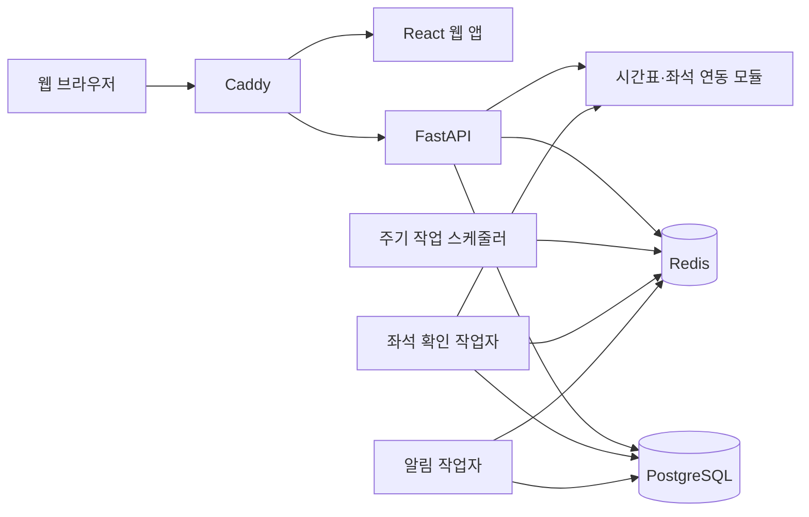

# 시스템 구조

이 문서는 레일웨잇의 전체 구성과 각 구성 요소의 책임을 설명합니다.

## 설계 목표

레일웨잇은 한 명의 관리자가 직접 운영하는 개인용 서비스입니다. 설계에서 우선하는 기준은 다음과 같습니다.

- 확인하지 못한 좌석 상태를 추정하지 않습니다.
- 같은 작업이 중복 실행되어도 예약 요청이 반복되지 않도록 막습니다.
- 시간표, 좌석 관측, 예약 결과를 서로 다른 정보로 다룹니다.
- 결제정보를 저장하거나 결제를 자동화하지 않습니다.
- 외부 서비스가 느리거나 차단되어도 마지막으로 확인된 데이터와 실패 원인을 구분합니다.

## 전체 구성



Docker Compose는 위 서비스를 하나의 배포 단위로 실행합니다. 웹과 API만 외부 요청을 받고, 데이터베이스와 작업 큐는 내부 네트워크에 둡니다.

## 구성 요소

### 웹 앱

`apps/web`은 React와 TypeScript로 작성된 반응형 PWA입니다.

- 여정과 시간 범위 입력
- 열차와 좌석 등급 선택
- 감시 중인 대기와 결제 필요 항목 표시
- 알림·철도 계정·화면 설정
- 공식 앱 또는 홈페이지로 이동하기 전 안내

화면은 API 응답을 그대로 표시하지 않습니다. 외부 응답을 검증한 뒤 화면에 필요한 형태로 바꾸며, 출처가 불명확한 좌석은 `확인 필요`로 표시합니다.

### API

`apps/api`의 FastAPI 서비스는 다음 책임을 가집니다.

- 관리자 인증과 세션
- 입력값 검증
- 대기 작업 생성·수정·취소
- 시간표와 좌석 정보 조회
- 알림 채널 설정
- 작업 상태와 이벤트 제공

경로 함수는 인증, 요청·응답 검증, 트랜잭션 경계를 담당합니다. 좌석 판단, 예약 시도, 알림 전달 같은 정책은 별도 서비스 모듈에 둡니다.

### 작업 처리

Celery 작업은 역할별 큐로 나뉩니다.

- 좌석 확인과 상태 전이
- 알림 전송과 재시도
- 주기 작업 예약
- 선택적인 철도사 연동 작업

좌석 확인과 알림 전송을 분리해 느린 외부 알림이 좌석 확인을 막지 않도록 합니다. 같은 운영사에 대한 동시 실행은 제한합니다.

### 데이터 저장소

PostgreSQL에는 관리자, 대기 작업, 열차 후보, 좌석 관측, 예약 시도, 알림 전송 이력을 저장합니다.

Redis는 작업 큐, 짧은 캐시, 중복 실행 방지 잠금과 호출 제한 상태에 사용합니다. 비밀번호, 쿠키, 브라우저 저장 상태를 Redis에 보관하지 않습니다.

### 철도사 연동

철도사별 연동 코드는 공통 계약을 구현합니다.

- 시간표를 조회할 수 있는가
- 좌석 상태를 확인할 수 있는가
- 대기 등록에 쓸 수 있는 근거가 있는가
- 제한적인 예매 시도를 지원하는가

기능이 구현되어 있고 운영자가 필요한 설정을 모두 켠 경우에만 사용할 수 있습니다. 설정이나 근거가 부족하면 해당 기능을 사용할 수 없도록 막습니다.

KORAIL Chromium과 SRT 연동 모듈은 선택 프로필에서만 실행됩니다. 기본 설치에서는 좌석 감시와 예매 시도가 꺼져 있습니다.

## 주요 흐름

### 열차 검색

1. 사용자가 출발역, 도착역, 날짜와 시간 범위를 입력합니다.
2. API가 역 식별자와 입력값을 확인합니다.
3. 운영사별 시간표를 조회합니다.
4. 한 운영사가 실패해도 다른 운영사의 정상 결과는 유지합니다.
5. 좌석 상태를 뒷받침할 근거가 없으면 시간표만 표시하고 좌석 관련 작업은 제공하지 않습니다.

### 대기 등록

1. 사용자가 열차와 좌석 등급을 선택합니다.
2. API가 최근 좌석 관측과 등록 가능 여부를 다시 확인합니다.
3. 열차와 좌석 등급마다 독립된 대기 작업을 만듭니다.
4. 화면에 대기 등록 결과를 표시합니다.

### 좌석 변화 확인

1. 스케줄러가 확인할 작업을 큐에 넣습니다.
2. 작업자가 같은 운영사의 중복 실행과 호출 제한을 확인합니다.
3. 새로운 관측값을 저장합니다.
4. 이전 상태와 비교해 의미 있는 변화만 작업 상태와 알림으로 만듭니다.
5. 확인이 불완전하면 좌석을 찾은 것으로 처리하지 않습니다.

### 알림

상태 변화는 먼저 발송 대기함에 기록한 뒤 별도 작업자가 전달합니다. 같은 사건이 반복 처리되어도 같은 알림이 계속 만들어지지 않도록 중복 방지 키를 사용합니다.

### 제한적인 예매 시도

이 기능은 운영사별 설정, 로그인 확인, 작업별 선택이 모두 갖춰진 경우에만 실행됩니다.

- 같은 좌석 가용 상태가 이어지는 동안 최대 한 번만 시도합니다.
- 결과가 불확실하면 같은 요청을 자동으로 반복하지 않습니다.
- 예약 결과는 공식 예약 내역에서 다시 확인할 수 있도록 안내합니다.
- 결제 단계 전에 멈춥니다.

정확한 사용 범위는 [안전 원칙과 사용 범위](POLICY_AND_SAFETY.md)를 따릅니다.

## 상태와 데이터의 구분

레일웨잇은 다음 정보를 섞지 않습니다.

- 시간표: 열차가 언제 어디로 운행하는지
- 좌석 관측: 특정 시점에 좌석 상태를 어떻게 확인했는지
- 대기 작업: 사용자가 어떤 열차와 좌석을 지켜보는지
- 예약 시도: 어떤 근거로 한 번의 요청이 실행됐는지
- 결제 필요: 예매 시도 결과 사용자가 공식 채널에서 예약 내역과 결제를 확인해야 하는 상태

화면에 표시하는 현재 좌석은 가장 최근의 유효한 관측을 사용합니다. 대기 등록 당시 정보는 변경 이력을 확인하기 위한 기록으로만 남깁니다.

## 중복과 장애를 다루는 방법

- 상태 변경 요청은 같은 요청 키로 다시 들어오면 기존 결과를 재사용합니다.
- 작업자는 중복 실행 방지 잠금을 얻은 작업만 처리합니다.
- 오래 걸린 과거 응답이 최신 상태를 덮지 못하도록 갱신 순서를 확인합니다.
- 외부 호출이 실패하면 재시도 간격을 점차 늘리고 운영사별 중단 시간을 적용합니다.
- 보호 응답과 호출 제한은 일반 오류보다 우선합니다.
- 마지막 정상 데이터가 있더라도 오래되면 현재 상태처럼 표현하지 않습니다.

## 인증과 비밀값

- 관리자 비밀번호는 Argon2id 해시로 저장합니다.
- 철도 계정과 알림 채널의 비밀값은 애플리케이션 키로 암호화합니다.
- 세션 쿠키는 HttpOnly와 SameSite 정책을 사용합니다.
- 상태 변경 요청은 허용된 출처와 CSRF 값을 확인합니다.
- 비밀번호, 쿠키, 토큰, 결제정보를 URL·로그·이벤트에 넣지 않습니다.

자세한 운영 설정은 [설치·운영 가이드](OPERATIONS.md)를 참고하세요.

## 코드 위치

```text
apps/web/                       화면과 브라우저 동작
apps/api/                       API, 도메인 정책, 작업 처리
apps/korail-browser-companion/  기존 설치 호환을 위한 단발성 가져오기 도구
infra/                          프록시, 관측, 백업 구성
scripts/                        운영과 검증 스크립트
docs/                           사용자·운영·개발 문서
```

웹 코드는 `app → features → api/domain/shared` 방향으로 의존합니다. API는 진입점, 애플리케이션 서비스, 도메인 정책, 외부 구현을 구분합니다. 세부 작성 규칙은 [코드 작성 규칙](CODE_CONVENTIONS.md)을 따릅니다.
